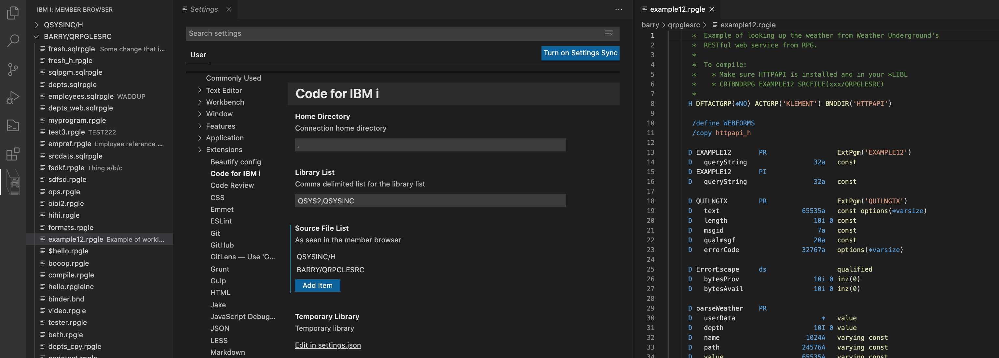

# Code for IBM i

Maintain your RPGLE, CL, COBOL, C/CPP on IBM i right from Visual Studio Code.

## Contributors

* [@connorholyday](https://github.com/connorholyday)
* [@worksofliam](https://github.com/worksofliam)
* [@alanseiden](https://github.com/alanseiden)
* [@richardschoen](https://github.com/richardschoen)
* [@barrettotte](https://github.com/barrettotte)
* [@thebeardedgeek](https://github.com/thebeardedgeek)
* [@dferrand](https://github.com/dferrand)
* [@dariocs](https://github.com/dariocs)
* [@priceaj](https://github.com/priceaj)

## Features

* Member browser and editor
* IFS Browser and editor
* Object browser
* Settings: Compilation, library list, etc,
* Error lists show up in Problems automatically

## Requirements

In order to use extension, SSH Daemon must be started on IBM i.

## How to get running

#### Install from VS Code

[You can find the extension in the VS Code Marketplace!](https://marketplace.visualstudio.com/items?itemName=HalcyonTechLtd.code-for-ibmi)

#### Run from local

1. clone repo
2. `npm i`
3. 'Run Extension' from vscode debug.

## Guide

#### How do I get syntax highlighting?

Install [IBMi Languages](https://marketplace.visualstudio.com/items?itemName=barrettotte.ibmi-languages) first! Thank you [@barrettotte](https://github.com/barrettotte).

#### Make a connection

1. Press F1
2. Find 'IBM i: Connect'
3. Enter in your connection details in the window that opens
4. Hit connect

Tip: next time, try using 'IBM i: Connect to previous'

#### Browse source members

1. Connect to your system
2. Find the member browser and hover your mouse over it until you see the folder with the plus icon
3. Click the icon. A window will appear to add a path to a source physical file you'd like to browse (format: `LIB/FILE`)
4. After you've entered your chosen source file, hit enter.
5. Source file should appear in member browser.

You can click on a member to open and edit it. There is no member locking and the extension does not retain source dates.

#### How do I compile my source code?

1. Edit your library list in the 'Code for IBM i' Settings for your current connection (connections get their own settings now!)
2. Edit the Actions in JSON format in the 'Code for IBM i' Settings too. You can define what commands to use for the compilations.
3. Open the source you want to compile
4. Use Ctrl+E or Cmd+E to compile your source.
5. If you have more than one compile option available to you for the type of source, it will prompt you
6. If you are using `*EVENTF`, it should automatically load the error listing in the Problems tab.