# Code for IBM i

## IBM i development extension for VS Code

Maintain and compile your RPGLE, CL, COBOL, C/CPP on the IBM i right from Visual Studio Code.
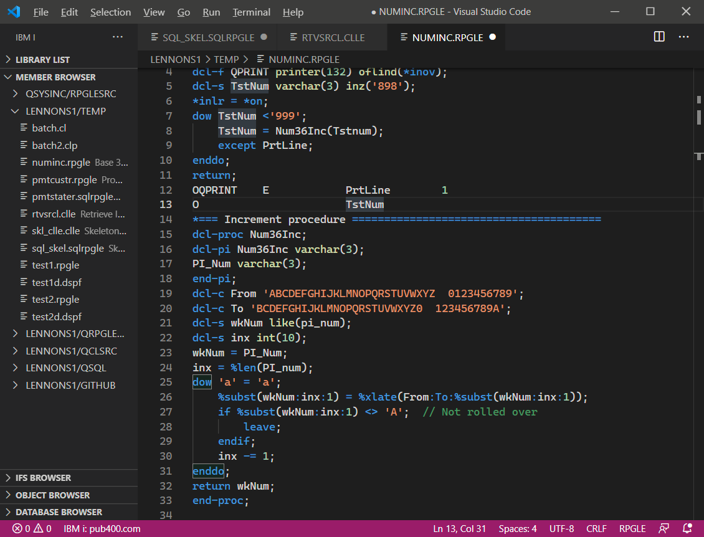

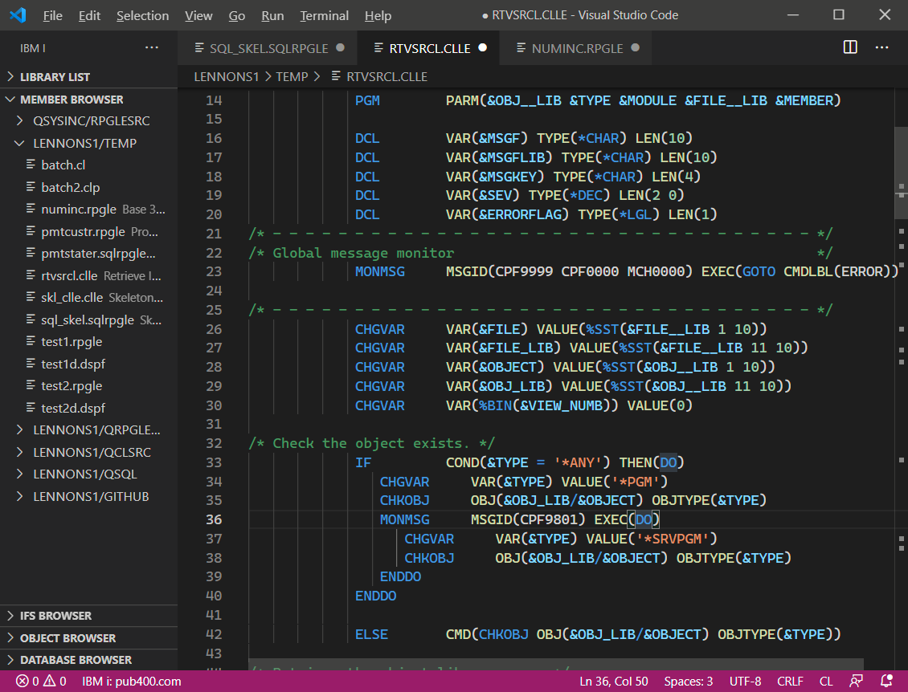

## Requirements

- SSH Daemon must be started on IBM i.
  (Licensed program 5733-SC1 provides SSH support. STRTCPSVR *SSHD starts the daemon.)
- Some familarity with VS Code. An introduction can be found [here](https://code.visualstudio.com/docs/getstarted/introvideos).

## Installation

From  VS Code Marketplace:  [Code-for-ibmi](https://marketplace.visualstudio.com/items?itemName=HalcyonTechLtd.code-for-ibmi)

Or from the Extensions icon in the Activity Bar (on the left):
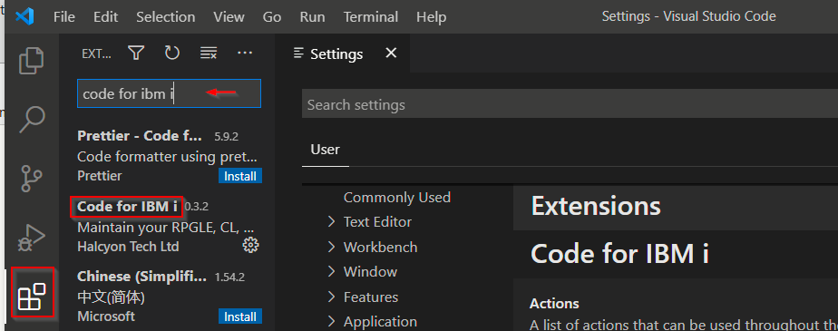

### Recommended Extensions

- [RPGLE language tools](https://marketplace.visualstudio.com/items?itemName=HalcyonTechLtd.vscode-rpgle) - Adds functionality to improve writing RPGLE.
- [IBMi Languages](https://marketplace.visualstudio.com/items?itemName=barrettotte.ibmi-languages) - Syntax highlighting for RPG, RPGLE, CL, and DDS. Is usually installed automatically.
- [IBM i Development Pack](https://marketplace.visualstudio.com/items?itemName=HalcyonTechLtd.ibm-i-development-pack) - a curated set of extensions built on or adding value to Code for IBM i.

## Quick Start Guide

### Make a connection

1. Press F1
2. Find 'IBM i: New Connection'
3. Enter in your connection details in the window that opens
4. Hit Connect

Tip: next time, try using 'IBM i: Connect to previous'

### Browse/Edit source members

1. Connect to your system.
2. Find the OBJECT BROWSER and click **+ Create new filter**.
3. Complete the new filter dialog, following the descriptive text, ensuring:
   a. That **Object** is the source physical file you want to edit.
   b. That  **Object type filter** is set to *SRCPF.
4. Save settings
5. Click on the filter to expand the members in the source file.
6. Click on a member to open it.

 **Note:** There is no member locking and the extension defaults to not retaining source dates.

### How do I compile my source code?

1. Edit your library list in the 'USER LIBRARY LIST' browser. (Each connection has its own library list.)
2. Open the source you want to compile.
3. Use Ctrl+E or Cmd+E to compile your source.
4. If you have more than one compile option available to you for the type of source, select the appropriate one.
5. If you are using `*EVENTF`, the error listing should automatically load in the PROBLEMS tab.

## Login

### Connect First Time

Click the IBM i icon.

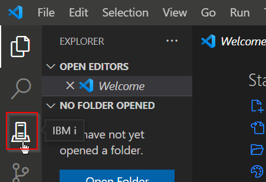

Click 'Connect to an IBM i'

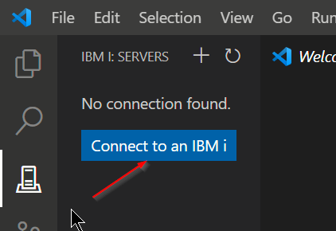

Complete this form. (You need either a password or a private key)


Alternatively, press <kbd>F1</kbd>, search for ```IBM i: New Connection```, and complete the above form.

### Connect Subsequent

If you have already connected to an IBM i system, click on the conection in the IBM i: SERVERS browser.


After logging in, a status bar item will appear showing the name
of the IBM i system you are connected to.


### Logout (Disconnect)

To close a connection and logout out, press <kbd>F1</kbd>, search for ```IBM i: Disconnect from current connection```

### Unstable Connections (Reconnect)

If your connection is unstable and is sometimes lost, check the setting "Show Reconnect Button". See *Settings: Global*, below. This will add a "Force reconnect to system" button to the task bar.

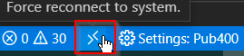

## Browsers

In the side bar there are several browsers to display and intereact with various parts of the IBM i:

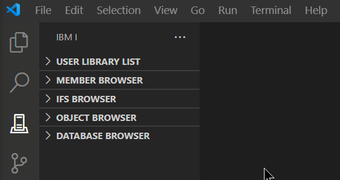

Each of these browsers can be expanded by clicking on it. Click on, or hover over, the browser title to see its action icons. Hover over each icon to see what it does.

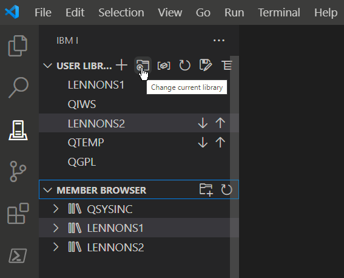

### User Library List

The User Library List is is set initially from your user profile.  Add libraries as needed using the "**+**" icon.  Remove a library from the library list by right clicking on it.

The User Library List is used when *Actions* (see below) are executed.

### Object Browser

The Object Browser allows you to interact with libraries, files, source files, programs and other types of objects. Subset the objects you want to work with by creating a filter or filters.

#### Create First Filter

Click on the **+ Create new filter** prompt to create your first filter (or click on the filter icon):

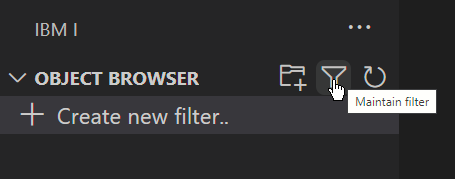

Complete the new filter dialog. The explanatory text in the Create Filter dialog explains the options:

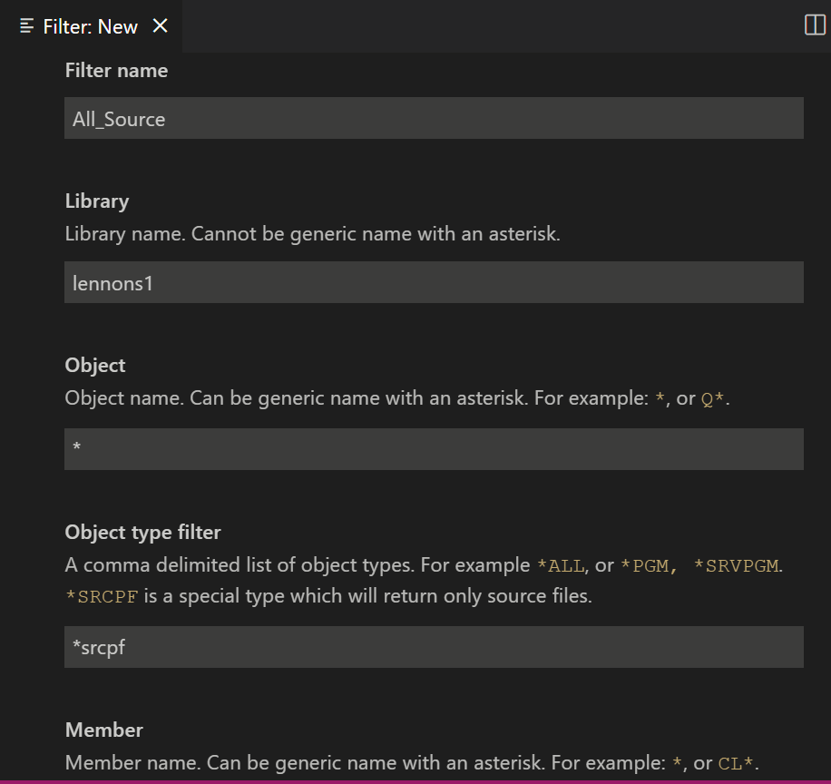

**Click SAVE to create the new filter.**

The above filter example lists all source files in library LENNONS1:

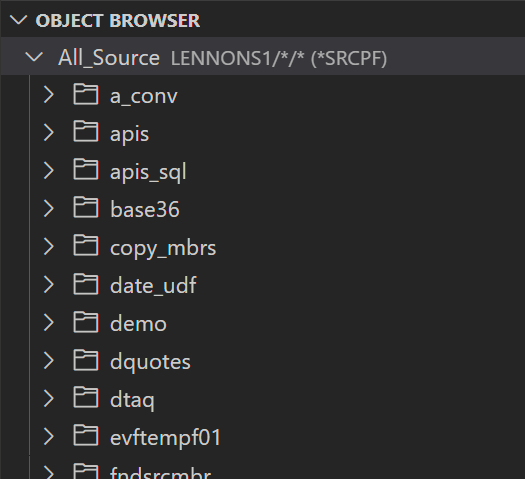

Note that the filter name has the filter definition the right.

#### Create Additional Filters

To create another filter,  click the filter icon to open up the new filter dialog.

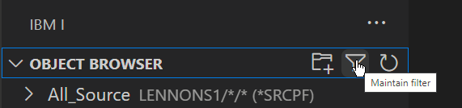

#### Filter Examples

**Single File Filter**


**Subsetted source member example**

A single source file files subsetting just some members:

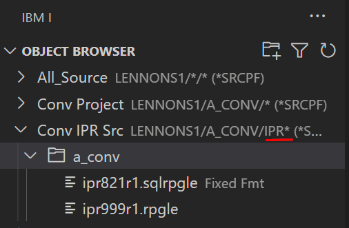

**Non Source Example**

Some programs in a library:

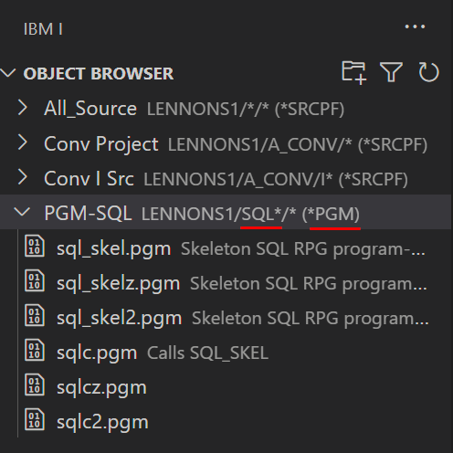

#### Maintaining Filters

Changing a filter definition is quick and easy. Just right click on the filter and chose **Maintain filter** to open up the filter dialog. Or chose **Delete filter** to remove the filter definition.

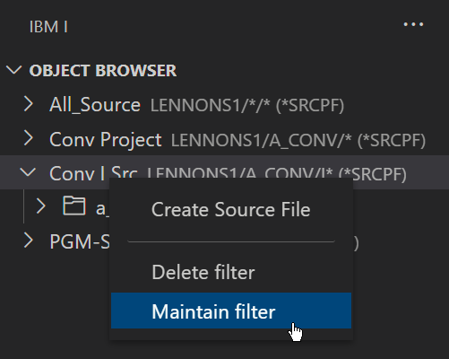

### IFS Browser

This shows directories and files in the IFS.  Click on a source file to open it in the editor.

Add extra shortcuts as needed:

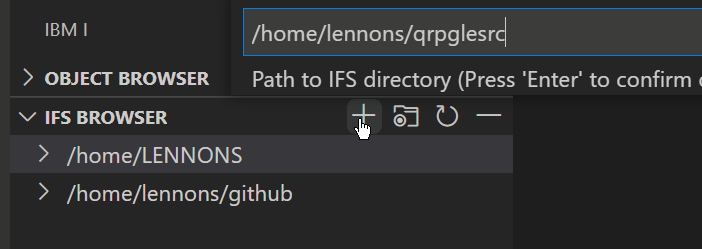

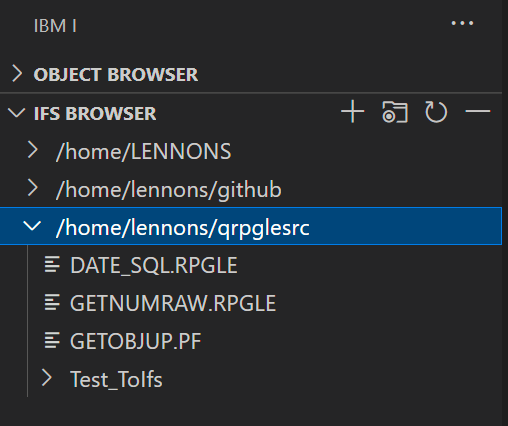

### Database Browser

This shows libraries and the files/tables in each. Click on a file or table to see the field names.

## Editing and Compiling

### Editing

Click on a source member or stream file in the browser to open it. You can have multiple sources open.

 

Now you can edit the source using all the features of VS Code.

To maximize your editing tab try:

- Hide/show the side bar with **Ctrl+B**. (Or using the View menu.)
- Toggle Full screen with **F11**
  
  

  Click **Help** in the menu for  tips, tricks, editing keyboard shortcuts and tutorials.

### Compiling

Compile the **active tab** with Ctrl+E.

- If there are unsaved changes, you will be told it first must be saved, and also given the option to always save before a compile.
If you click **Save Automatically**, sequent compile requests will always save first if there are changes. (In *Settings: Connection*, below, you can turn off the auto save option.)

- If there is more than one compile option for your source type, select the appropriate one.

If the compile completes without error you will see an informational message like this:


### Compile Errors

If the compile fails, you will see an error message like this:


In the source, the errors will be highlighted with squiggly lines, and if you hover over the squiggly line you see details of the error:


You can jump to the next error with **F8**.  **Shift+F8** for the previous error.


If you have the PROBLEMS tab open in the Panel, it shows the list of errors. Clicking on a line in the PROBLEMS tab will take you to the line in the source. (Ctrl+J opens the panel, Ctrk+Shift+M opens the PROBLEMS tab.)


Decide which Errors, Warnings or Info messages to show using the Filter icon. If you have been compiling several sources then you may also want to check **Show Active File Only**;


You can remove all the squiggly line using F1 and searching for IBM i Clear Diagnostics:


### Compile Listing

If you have *Log Compile Output* checked in settings (see *Settings: Global*, below), then compile listings are found under the Output tab by selecting IBM i Output.  Use the shortcut Output icon on the tool bar to jump to the compile listing.


## Actions

An action is used to perform a task on a member, streamfile or other type of object. A comprehensive default set of actions is loaded directly from the extension. You can also easily change or add to actions--see *View/Change/Add Actions*, below.

If you change or add actions as below, then all actions are saved in the ```code-for-ibmi.actions``` section in ```settings.json```. You can also edit the```code-for-ibmi.actions``` section manually. If it doesn't exist, you can create you own ```code-for-ibmi.actions``` section in ```settings.json```.  

**Note:** When  a  ```code-for-ibmi.actions``` section  exists in ```settings.json``` the set of actions is loaded from there, not from the default set in the extension.

<!-- 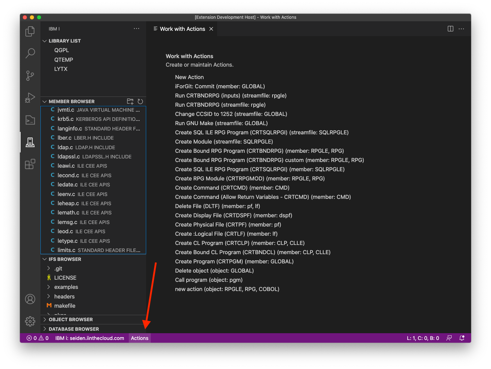 -->

Actions are defined commands used to perform tasks on members, streamfiles and other types of objects. For example, to compile a source file. Actions can be executed from two different places:

- As you're writing code. For example, to compile a program or module.
- When you right click on a member, streamfile or an object from the OBJECT BROWSER.

A comprehensive set of Actions is provided, but you can add more or change the ones provided.

### Running an Action

To run an Action, open a source member (or IFS streamfile) and press the shortcut key:

- Windows: Control + E
- Mac: Command + E

This shows a dropdown of the available Actions for the open file. Use the arrow keys to select which Action to run and hit enter to select it.

Example: to run the 'CRTBNDRPG' Action, you must open a source member with either `RPG` or `RPGLE` as the extension. Then, when you use the Run Action shortcut (above), you will see the list of available Actions.

### View/Change/Add Actions

 Click **Actions** on the status bar, then view, change or add new Actions in this UI:


- Click on an action to change it.
- Add actions with New Action.
- Copy an existing action and modify it with Duplicate.

Adding or changing, you see this same UI:

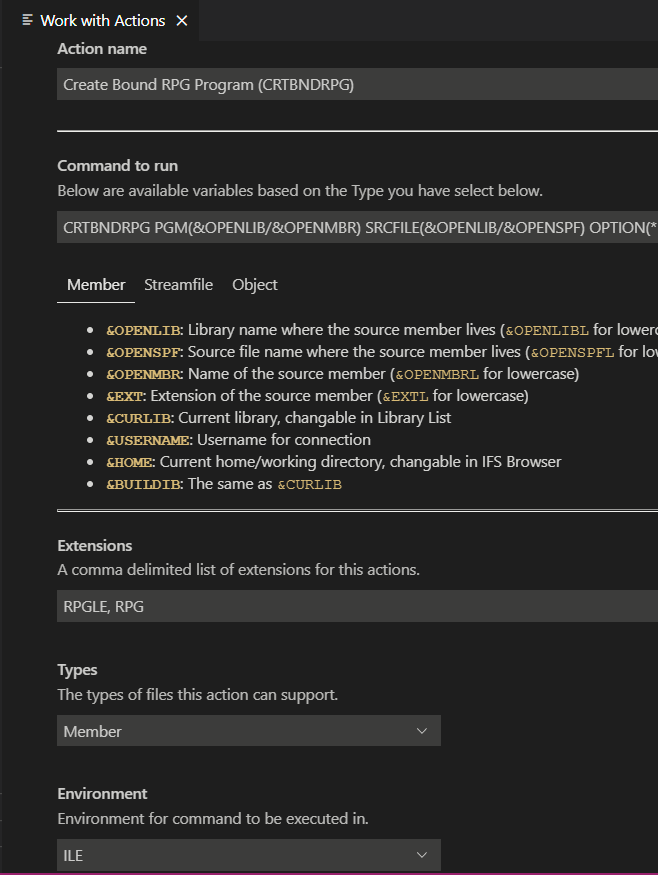

In the example above we are editing 'Create Bound RPG Program (CRTBNDRPG)'. We can change any of the properties.

- '**Command to run**' is the command that will be executed. Notice it has portions of text that start with an `&` (ampersand) - such text is a "variable" that will be substituted when the action is run. Commands can have different variables based on what 'Type' (member, streamfile, object) is specified. Note that in addition to the supplied variables, you can create your own variables.  See "Custom Variables", below.
- '**Extensions**' defines the list of extensions that can use this Action. For `CRTBNDRPG`, that usually means only `RPGLE` and `RPG`, so we would enter: `RPGLE, RPG`.
- '**Types**' determines which type of object can run this action. For example, if your Action only applies to source members, then choose 'Member' from the dropdown.
- '**Environment**' determine where the command should be run. In this case, `CRTBNDRPG` needs to run in the ILE environment since it's an ILE command. You also have the option to run commands through PASE or QShell.

When complete, **click Save**. If you simply close the tab, nothing will be saved.

## Action Execution

There are four varieties of Actions. They can:

- if type is `file` and 'deploy first' is enabled, deploy the workspace, then:
- execute immediately,
- or they can be displayed for modification,
- or they can be prompted through the user interface.

### Execute Immediately

If we have a "**Call program**" command with a "Command to run" string like this:

`CALL &LIBRARY/&NAME`  

It will execute immediatly it is selected.

### Display for modification

If the "Command to run" string has a leading "**?**", e.g., like this:

`?CALL &LIBRARY/&NAME`  

It is displayed and you can edit it as needed.

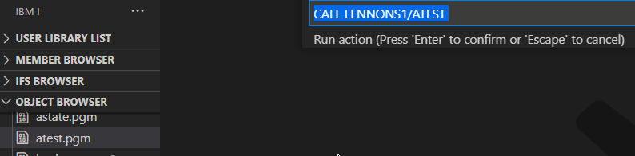

For example, you might want to add **PARM('Douglas' 'Adams')** to the end.


### Prompted

Rather than using the "?", you can have the Action prompt for values.
The "Command to run" string can have embedded prompt string(s) to invoke prompting.

A "prompt string" has the format ``${NAME|LABEL|[DEFAULTVALUE]}`` where:

- NAME is an arbitrary name for the prompt field, but must be unique for this action.
- LABEL is the text to describe the prompt field.
- [DEFAULTVALUE] is an **optional** value to pre-populate the prompt field.

#### *Example 1*

Suppose we have a "**Call program, prompt for parms**" action with the "Command to run" defined like this:

``CALL &LIBRARY/&NAME PARM('${AAA|First name|Your name}' '${xyz|Last Name}')``

If we run the action it prompts like this:

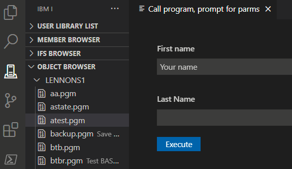

If we complete the screen like this:


and click **Execute** a command like this is executed;

``CALL LENNONS1/ATEST PARM('Douglas' 'Adams')``

#### *Example 2*

You can also use variables in the prompt string. If an action is defined like this:

``CALL &LIBRARY/&NAME PARM('${AAA|Library|&CURLIB}' '${xyz|Report Name}')``

&CURLIB will be substituted and the prompt will look like this when executed:

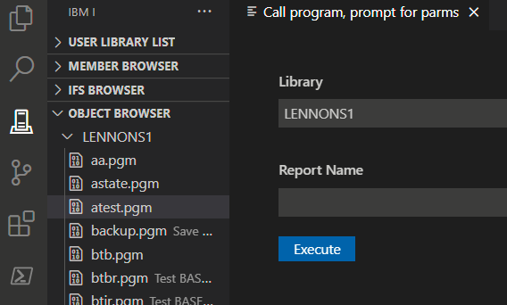

#### *Example 3*

Here's a more complex example of a "**Run CRTBNDRPG (inputs)**" action.
The 'Command to run" string is defined like this:

``CRTBNDRPG PGM(${buildlib|Build library|&BUILDLIB}/${objectname|Object Name|&NAME}) SRCSTMF('${sourcePath|Source path|&FULLPATH}') OPTION(*EVENTF) DBGVIEW(*SOURCE) TGTRLS(*CURRENT)``

When executed, it prompts like this: 

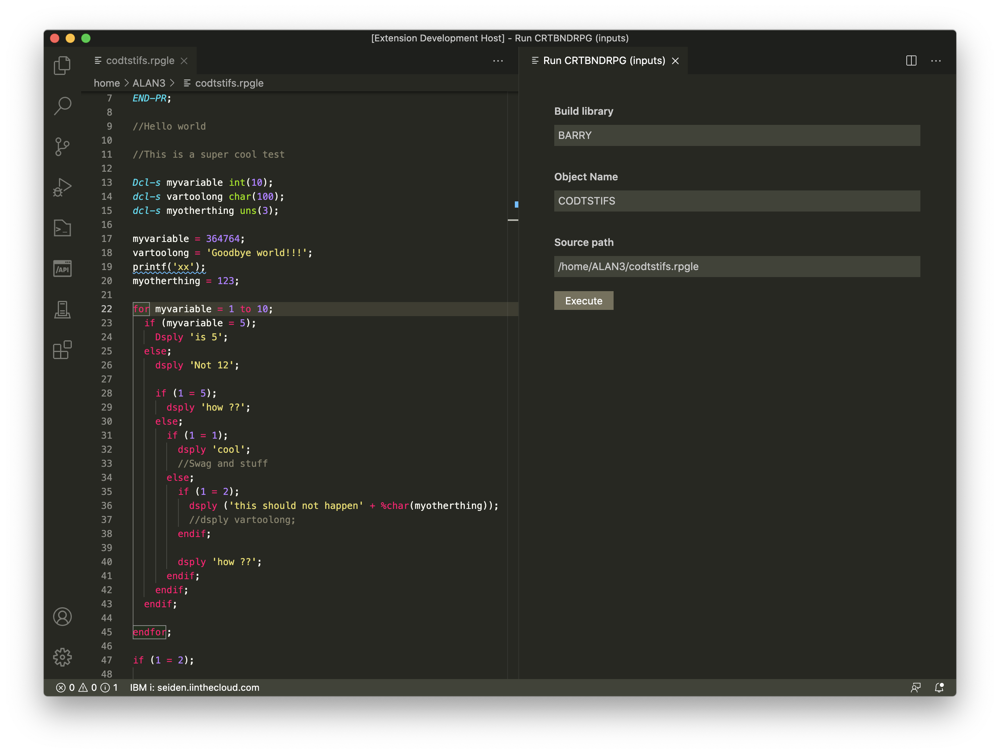

### Custom Variables

You can create custom variable to use in your "Command to run" strings. To access custom variables:
 Use <kbd>F1</kbd>, then search for "IBM i Custom variables":

 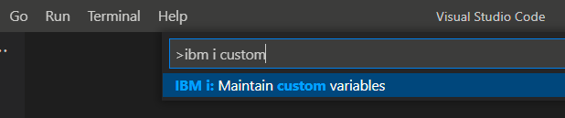
 
 Or from the User Library List browser:

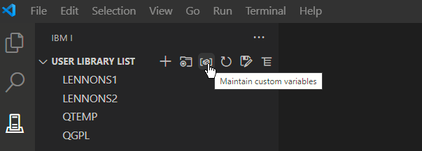

In the **Work with Variables** tab, click on **New Variable** to add your variable:

 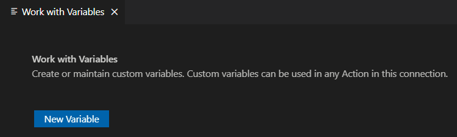
 
 Here we are adding a variable named &TARGET_RLSE.

 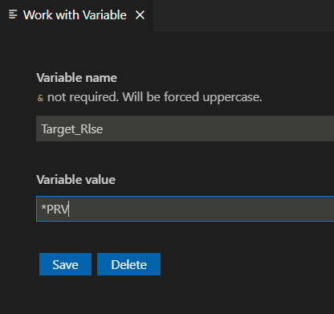

Press Save and the list of custom variables is shown:

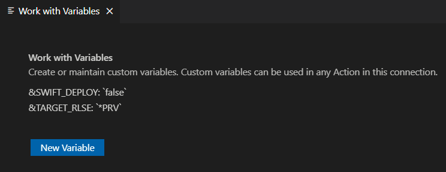

Click on a custom variable to change it or delete it.

#### *Example Usage*

In all the  CRTBNDxxx actions add TGTRLS(&TARGET_RLSE), like this:

`?CRTBNDCL PGM(&OPENLIB/&OPENMBR) SRCFILE(&OPENLIB/&OPENSPF) OPTION(*EVENTF) DBGVIEW(*SOURCE)  TGTRLS(&TARGET_RLSE)`

Now a single change to the TARGET_RLSE custom variable can impact all the CRTBNDxxx actions.

## Workspaces & Deployment

It is possible for the user to deploy a workspace folder directly to the IBM i from VS Code.

If the user opens a Workspace before connecting to an IBM i:

1. a new right-click option will appear on IFS directories to deploy to that directory
2. a 'Deploy' button will appear on the status bar

### 1. Setting the deploy directory

In the IFS Browser, the user can right-click on any directory and select the 'Deploy Workspace to directory' option. If their workspace has more than one folder opened, the user will be prompted to choose which folder will be deployed to that directory. The user needs to have this folder setup before they can deploy your workspace.

The user can change the deploy directory at any by using the same right-click option on another directory. 

When the user has used the right-click option, they will be asked if they want to run the deploy then.

### 2. The Deploy button / Running the deployment process

Using the 'Deploy' button will start the deployment process. For the deployment process to run, VS Code needs to know which folder to deploy to and will fail if it has not been setup correctly. If the workspace has more than one folder, the user will have to select which folder they want to deploy.

There are two options for deployment:

1. Staged Changes: This only works if the chosen deployment folder is a git repository. Code for IBM i will look at the git status to determine the staged / indexed files and only upload those.
2. All: Will upload all files in the chosen workspace folder. Will ignore files that are part of the '.gitignore' file if it exists.

The user can also defined Actions that are for the 'file' (local) type to run the deploy before running the Action.

### 3. Workspace Actions (deploy & build)

Similar to other repository settings, users can now store Actions as part of the Workspace. Users can now create `.vscode/actions.json` inside of your Workspace, and can contain Actions that are specific to that Workspace. That configuration file should also be checked into git for that application.

Here is an example `actions.json` setup, which requires deployment to happen before triggering BoB. VS Code will prompt content assist when working with `actions.json`. You could replace BoB with any build system here (e.g. make, or perhaps a vendor-specific tool.).

```json
[
  {
    "name": "Deploy & build 🔨",
    "command": "/QOpenSys/pkgs/bin/bash -c \"error=*EVENTF lib1=&CURLIB makei -z &NAME.&EXT\"",
    "extensions": [
      "GLOBAL"
    ],
    "environment": "pase",
    "deployFirst": true
  }
]
```

Now, when the user runs an Action against the local file (with `Control/Command + E`), they will appear in the list. 


## Settings: Global

These are setting  which affect the extension (and therefore *every* connection). To adjust the extension's global setting,  either:

- Use the standard VS Code <kbd>Ctrl</kbd> + <kbd>,</kbd> and click Extensions
- or click File/Preferences/Settings and click Extensions
-or  press <kbd>F1</kbd>, search for ```Preferences: Open Settings (UI)``` and click extensions.

Settings for the extension will be under ```Code for IBM i```


Most of the setting have a self explanatory description. A few have notes below.

### Actions

Actions can be edited in settings.json, but also more easily by clicking **Actions** in the status bar. See *Actions*, above.

### Connections

Connections can be edited in settings.json, but you'd typically add additional connections as in *Connect First Time*, above.

### Connection Settings

These are the various setting relating to the items in the browsers, e.g., the list of source files in the OBJECT BROWSER. While these can be edited in settings.json, most can be more easily maintained by clicking or right clicking on an item in the browser.

### Log Compile Output

When enabled, spool files will be logged from the command execution.
These spool files can be found under the **OUTPUT** tab (View->Output, or Ctrl + Shift + U). Select **IBM i Output** in the drop down on the right.

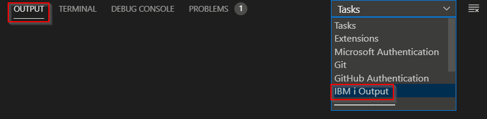

You can clear the OUTPUT tab using the **Clear Output** icon on the right.
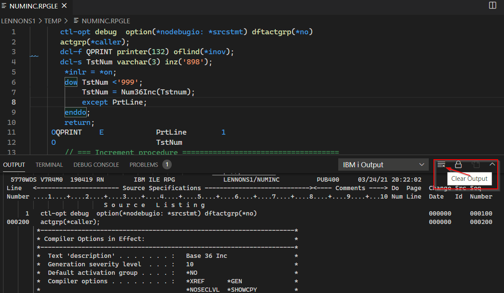

You can change the font size in the OUTPUT tab in your settings.json thus:

````json
"[Log]": {
        "editor.fontSize": 11
    },
````

## Settings: Connection

Multiple connections can be defined and some settings are specific to a connection and can be saved for the connection and later reloaded.

### Connection profiles

 We call these connection specific settings a 'connection profile'. The settings stored into a profile are:

- Those settings maintained by clicking Settings in the status bar 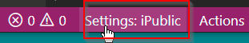

- The Home / working directory
- The Current library
- The Library list
- The IFS shortcuts
- The Object browser list
- The Database browser list

Save the settings into a profile using the S**ave current settings button** on the USER LIBRARY LIST view.


Give it a unique name, or use an existing name to overwrite an existing profile.

To load a profile, which would update the settings, use the **Set active profile** button on the Library List view.
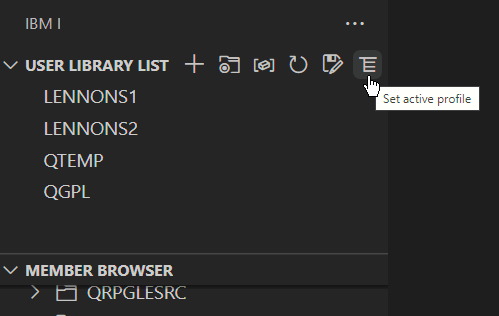

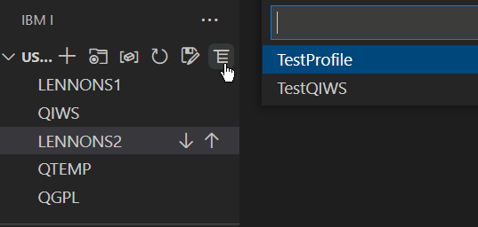

You might use this if you use a single box to manage many different applications that have different source files and/or library lists.

#### Current library

The library which will be set as the current library during compilation.

You can change the current library with the 'Change build library' command (F1 -> Change build library).

#### Home Directory

Home directory for user. This directory is also the root for the IFS browser.

#### Temporary library

Temporary library. Stores temporary objects used by Code for i. Will be created automatically if it does not exist. Cannot be QTEMP.
Default value: ILEDITOR.
Note: If your IBM i runs replication software, there is no need to replicate the temporary library. Your sysadmin may add it to the list of objects to be ignored.

#### Temporary IFS directory

Temporary IFS directory. Stores temporary IFS files used by Code for i. Will be created automatically if it does not exist. Must be in root or QOpenSys filesystem.
Default value: /tmp.
Note: If your IBM i runs replication software, there is no need to replicate the temporary directory. Your sysadmin may add it to the list of path to be ignored.
It is safe to have files created by Code for i automatically deleted during maintenance or IPL.

#### Source ASP

If source files are located in a specific ASP, specify here.
Otherwise, leave blank.

#### Open from IBM i

When enabled, it is possible to open a member or a stream file in Code for IBM i from an IBM i job. Only one instance of Code for IBM i per user profile can do the opening (the first one to connect to the IBM with each user profile).
To open a member or a stream file, simply write its name into a named pipe called `vscodetemp-O__`*`usrprf`* in the temporary IFS directory (/tmp by default).
For a stream file, simply write the absolute path of the stream file (starting with `/`).
For a member, use the format `library/file/member.type` or `asp/library/file/member.type`.
The path should be written in UTF-8 encoding. The named pipe is set to CCSID 1208 (UTF-8) so writing in text mode with a CCSID aware tool (like QShell) should take care of the conversion.

For example:
````
QSH CMD('echo DEVLIB/QDDSSRC/DSPF1.DSPF > /tmp/vscodetemp-O__DEVUSR1')
QSH CMD('echo /home/DEVUSR1/src/dspf1.DSPF > /tmp/vscodetemp-O__DEVUSR1')
````

#### Enable source dates

When enabled, source dates will be retained.

## Snippets

Code for IBM i comes with a large set of built-in RPGLE snippets, if you install the *RPGLE language tools* extension. For example, here's what you might see if you entered %scan in an RPGLE member:
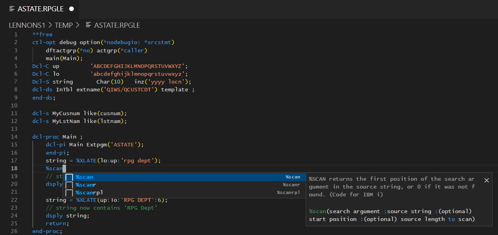

You can also add your own snippets. Check out the [VS Code Snippet Documentation](https://code.visualstudio.com/docs/editor/userdefinedsnippets)

## Comparing sources

Compare two sources, whether they are members or streamfiles.

1. right click on either type, choose 'Select for compare'
2. right click the other source you'd like to compare with and choose 'Compare with Selected'

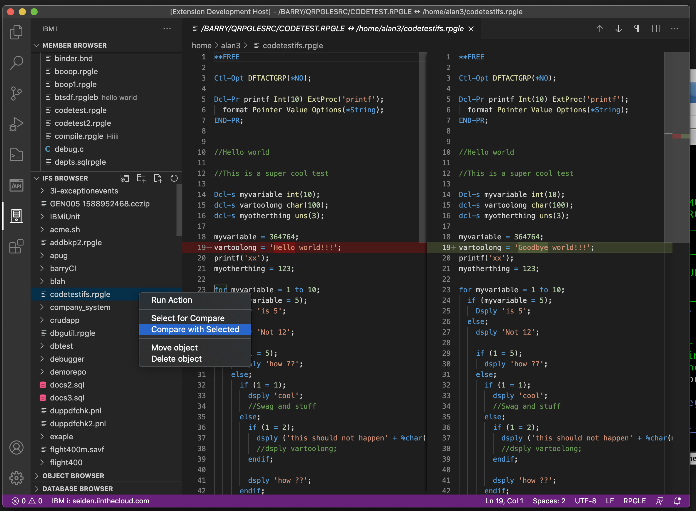

## Database Browser

The database browser allows you browse tables in schemas on your connected system. The schema list comes from the defined library list.

Clicking on a schema will load all tables, views, PFs, and LFs inside of the chosen schema. Click on any of those SQL objects will show you what columns are availabe. The tree view is primarily used for information purposes. When the schema has been opened, it will then add snippets to the editor when editing `.sql` sources.

### Hovering tables shows information it

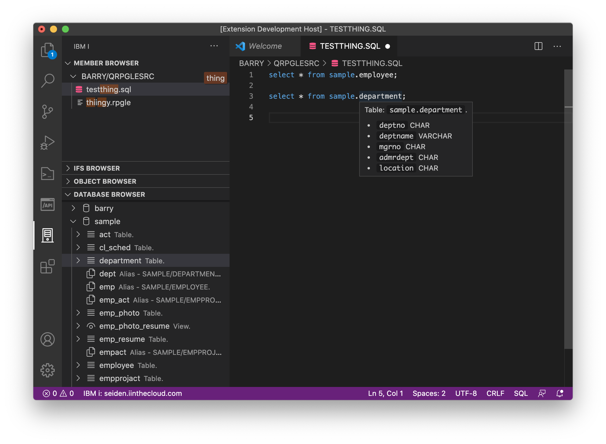

### Editor will provide snippets to insert

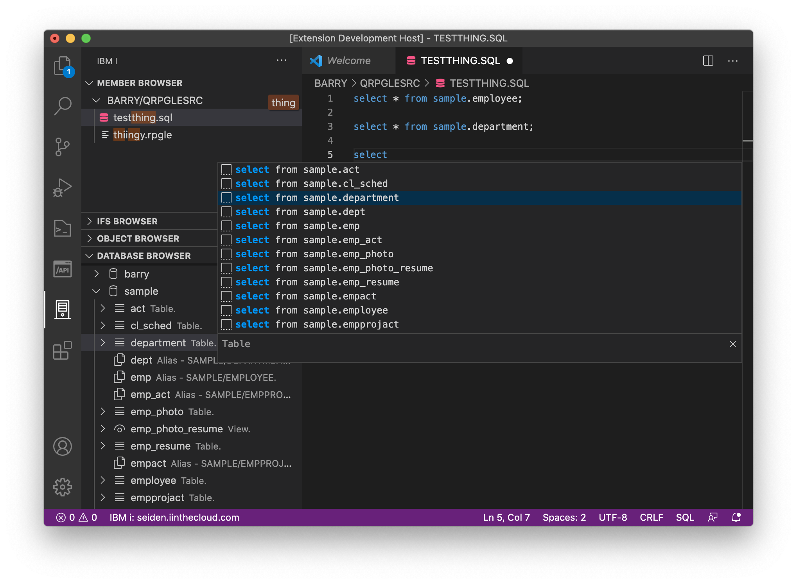

### Viewing result sets

It is also possible to run SQL statements right from the editor. You can either highlight the statement you want to run or move your anchor over the statement and use Ctrl+R/Cmd+R to execute the statement. **note: statements only run in SQL mode and does not inherit the library list**

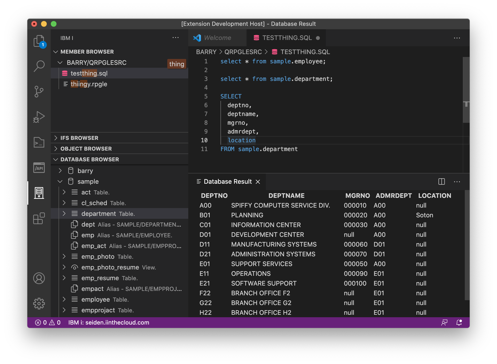

## Tips & Tricks

### Search source files and IFS directories

Right click and click 'Search' on IFS directories and source files to search through the content of streamfiles and source members.

### Overtype

VS Code works in "insert" mode. This can be annoying when editing a fixed mode source, for example DDS. Fortunately there is an [Overtype extension](https://marketplace.visualstudio.com/items?itemName=DrMerfy.overtype) that allows you to toggle between insert and  overtype, and can also display the current mode in the status bar.

### Font Size

Font size in the editor is controlled by the VS Code setting *Editor: Font Size*.  However, with your cursor in an editor, you can also temporarily change the editor font size by holding Ctrl and using your mouse scroll bar.

Font size in the Menu, Side, Status and Activity bars can be changed using holding down Ctrl, then using  + or -. Such changes will hold from session to session. However, this will also change the size of the editor font and you may have to adjust it as above for this session.

Rule of thumb: Experiment.

### Integrated terminals

It is possible, using the Terminals button in the lower left-hand corner, to select a Terminal to launch:

* PASE: will launch into the pase environment
* 5250: will launch a 5250 emulator right into the connected system. For this functionality, `tn5250` must be installed on the remote system. This can be installed via yum.
   - **Do the function keys work?** Yes.
   - **It is possible to do a system request?** Yes. Use Command+C.
   - **How do I end my session?** Use the Terminal bin in VS Code.
   - **I am stuck with `Cursor in protected area of display.`!** Use Command+A to get attention, then use F12 to go back.
   - **What are all the key bindings?** [Check them out here](https://linux.die.net/man/1/tn5250).

### Variant Characters/CCSID Issues

Use of variant characters, for example, '£', in your file names or source code may cause files not to open or characters to display incorrectly in Code for IBM i. If you are experiencing such issues, it is likely the IBM i PASE environment locale is not set correctly.
To ensure that the locale is set correctly:

- OS 7.4 or greater:

  It defaults to UTF-8 and there should be no issue.

- OS 7.3 or earlier:

  The SSH daemon must start with the correct PASE_LANG environment variable set. Note you probably want to use a locale that defaults to CCSID 1208. Note also case sensitivity: FR_FR is different from fr_FR.

  - Change just once by USING ``WRKENVVAR LEVEL(*JOB)`` to set the appropriate locale/language, e.g., ``PASE_LANG 'IT_IT'``.  **Restart** the SSH daemon.
  
  - Change the PASE language *system wide* by using ``WRKENVVAR LEVEL(*SYS)`` to set the appropriate locale/language, e.g., ``PASE_LANG 'FR_FR'``.  **Restart** the SSH daemon.

You can find infomation on PASE for i Locales [here](https://www.ibm.com/docs/en/i/7.4?topic=ssw_ibm_i_74/apis/pase_locales.htm)

Some links to pages which containing information on variant characters:

- [IBM definition of Variant characters](https://www.ibm.com/docs/en/db2-for-zos/11?topic=ccsids-variant-characters)

- [IBM Support](https://www.ibm.com/support/pages/what-impact-changing-qccsid-shipped-65535-another-ccsid)

- [Wikipedia](https://en.wikipedia.org/wiki/EBCDIC)

## Extension Development

1. clone repo
2. ```npm i```
3. 'Run extension' from VS Code debug.

### Documentation

#### Getting Started

- install docsify ```npm i docsify-cli -g```
- run local with ```docsify serve docs/```
- by default, runs on http://localhost:3000
- Read more about [Docsify](https://docsify.js.org/#/)

#### File Structure

- ```docs/README.md``` is the main documentation file
- ```docs/index.html``` would be for styling tweaks, Docsify configuration, or adding syntax highlighting (PrismJs)
- ```docs/_sidebar.md``` is for utilizing separate markdown files (chapters in a book is a good comparison)
