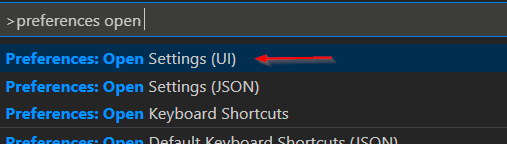

# code-for-ibmi

## IBM i development extension for VS Code

Maiintain and compile your RPGLE, CL, COBOL, C/CPP on the IBM i right from Visual Studio Code.


## Requirements

- SSH Daemon must be started on IBM i.
  (Licensed program 5733-SC1 provides SSH support. STRTCPSVR *SSHD starts the daemon.)
- Some familarity with VS Code. An introduction can be found [here](https://code.visualstudio.com/docs/getstarted/introvideos).

## Installation

From  VS Code Marketplace:

[Code-for-ibmi from the VS Code Marketplace](https://marketplace.visualstudio.com/items?itemName=HalcyonTechLtd.code-for-ibmi)

Or from the Extensions icon in the Activity Bar (on the left):


### Recommended Extensions

- [IBMi Languages](https://marketplace.visualstudio.com/items?itemName=barrettotte.ibmi-languages) - Syntax highlighting for RPG, RPGLE, CL, and DDS

## Login

Press <kbd>F1</kbd>, search for ```IBM i: Connect```, and press enter to arrive at the login form below.


If you have already connected to an IBM i system, you can use ```IBM i: Connect to previous``` to reconnect and save time typing.


Alternatively, use the sidebar button to reach the same two connect options and the subsequent login form.


After logging in, a status bar item will appear showing the name
of the IBM i system you are connected to.


## Settings

To adjust this extension's settings, press <kbd>F1</kbd> and search for ```Preferences: Open Settings (UI)```.



Settings for this extension will be under ```Code for IBM i```


## Actions

Actions can be used to perform tasks on members, streamfiles and eventually other types of objects too.

Here is an example of the action used to compile an RPG member:

```json
"code-for-ibmi.actions": [
  {
    "type": "member",
    "extensions": [
      "rpgle",
      "rpg"
    ],
    "name": "CRTBNDRPG",
    "command": "CRTBNDRPG PGM(&OPENLIB/&OPENMBR) SRCFILE(&OPENLIB/&OPENSPF) OPTION(*EVENTF) DBGVIEW(*SOURCE)"
  }
]
```

The available `type` property values are:

- `member` for source members
- `streamfile` for streamfiles
- `object` for objects

You can also use the `environment` property to run the action in a certain environment:

- `ile` (default) to run CL commands in the ILE environment
- `qsh` to run commands in QShell
- `pase` to run commands in pase

Other important properties:

- `extensions` property is used to tie the action to certain types of files or objects.
- `name` is used to identify the action when selecting and running them.
- `command` is used to define what will be executed. Read about command below.

### Command variables and fields

> `CRTBNDRPG PGM(&OPENLIB/&OPENMBR) SRCFILE(&OPENLIB/&OPENSPF) OPTION(*EVENTF) DBGVIEW(*SOURCE)`

Notice the special identifiers in the command begining with `&`. These identifiers correspond to values of whichever member is currently open in the extension. Each `type` has different variables.

#### Member variables

| Variable | Usage                              |
|----------|------------------------------------|
| &OPENLIB | Library that member resides in     |
| &OPENSPF | Source file that member resides in |
| &OPENMBR | Name of member                     |
| &EXT     | Member extension                   |
| &BUILDLIB | Values which comes from the connection settings |
| &USERNAME | Username being used to connect to the current system |

#### Streamfile variables

| Variable  | Usage                                           |
|-----------|-------------------------------------------------|
| &BUILDLIB | Values which comes from the connection settings |
| &FULLPATH | Path to the streamfile.                         |
| &NAME     | Name of the streamfile with no extension        |
| &EXT      | Extension of basename                           |
| &USERNAME | Username being used to connect to the current system |

#### Object variables

| Variable  | Usage                             |
|-----------|-----------------------------------|
| &LIBRARY  | Library in which the object exists|
| &NAME     | Name of the object                |
| &TYPE     | The object type (PGM, FILE, etc)  |
| &BUILDLIB | Values which comes from the connection settings |
| &USERNAME | Username being used to connect to the current system |

#### Command fields

It is possible to prompt the user specific fields with the custom UI functionality. The command string also accepts a variable format. It looks like this:

```
${NAME|LABEL|[DEFAULTVALUE]}
${desc|Description}
${objectName|Object name|&BUILDLIB}
```

It takes 3 different options:

1. The ID of the input box. Also known as the name.
2. The label which will show next to the input box.
3. Default value in the text box. **optional**

Example:

```json
{
    "type": "streamfile",
    "extensions": ["rpgle"],
    "name": "Run CRTBNDRPG (inputs)",
    "command": "CRTBNDRPG PGM(${buildlib|Build library|&BUILDLIB}/${objectname|Object Name|&NAME}) SRCSTMF('${sourcePath|Source path|&FULLPATH}') OPTION(*EVENTF) DBGVIEW(*SOURCE) TGTRLS(*CURRENT)"
},
```


### Auto Refresh

When enabled, listings will refresh when items are interacted with (create, copy, delete, etc). If performance is bad, it is suggested you disable this option.

### Log Compile Output

When enabled, spool files will be logged from the command execution.
These spool files can be found under the **OUTPUT** tab (View->Output, or Ctrl + Shift + U). Select **IBM i Output** in the drop down on the right.


You can clear the OUTPUT tab using the **Clear Output** icon on the right.


You can change the font size in the OUTPUT tab in your settings.json thus:

````json
"[Log]": {
        "editor.fontSize": 11
    },
````

### Connections

List of connection details from prior connections.

Here is a snippet of what the connection details look like:

```json
"code-for-ibmi.connections": [
  {
    "name": "My IBMi Connection",
    "host": "DEV400",
    "port": 22,
    "username": "OTTEB",
    "privateKey": null
  }
],
```

#### Connection Settings

An array of objects. Each object is unique by the host property and is used so different connections can have their own settings. **Note that connection properties can only be edited in the form of JSON, other than certain places in the UI**

```json
    "code-for-ibmi.connectionSettings": [
        {
            "name": "My IBMi Connection",
            "host": "seiden.iinthecloud.com",
            "sourceFileList": [
                "QSYSINC/H",
                "BARRY/QRPGLESRC",
                "MYPROJ/QRPGLESRC"
            ],
            "libraryList": [
                "QSYS2",
                "QSYSINC",
                "SAMPLE"
            ],
            "homeDirectory": "/home/alan3/apug",
            "tempLibrary": "ILEDITOR",
            "buildLibrary": "QTEMP",
            "sourceASP": null
        }
    ]
```

#### Source File List

Source files to be included in the member browser.

#### Library List

An array for the library list. Highest item of the library list goes first. You are able to use `&BUILDLIB` in the library list, to make compiles dynamic.

```json
"libraryList": [
    "&BUILDLIB",
    "DATALIB",
    "QSYSINC"
]
```

#### Home Directory

Home directory for user. This directory is also the root for the IFS browser.

#### Temporary library

Temporary library. Is used to OUTPUT files. Cannot be QTEMP.

#### Build library

A library that can be defined/changed for IFS builds. You can also change the build library with the 'Change build library' command (F1 -> Change build library).

#### Source ASP

If source files are located in a specific ASP, specify here.
Otherwise, leave blank.

## Adding Source Files

In order to make the member browser useful, source files need to be declared
in the ```Code for IBM i``` settings.

In the **Source File List** setting, additional source files can be added
by clicking the **Add Item** button.
The source file follows the intuitive ```LIB/SRCPF``` format.


Now in the **Member Browser**, source files will appear.
Each source file can be expanded to reveal its members.


A source file can be refreshed by right clicking and selecting **Refresh Member List** in the context menu.


## Opening Source Members

After adding a source file, a source member can now be opened by selecting
it in the member list.


## Comparing sources

It is now possible to compare two sources, whether they are members or streamfiles.

1. right click on either type, choose 'Select for compare'
2. right click the other source you'd like to compare with and choose 'Compare with Selected'
3. Profit ???


## Compiling Sources

Pressing <kbd>F1</kbd> and search for ```IBM i: Run Action```
will reveal two commands that can compile a source member.


Notice how ```IBM i: Run Action on Active Editor``` can be executed with
<kbd>CTRL</kbd> + <kbd>E</kbd>.

To compile a source member, run the ```IBM i: Run Action on Active Editor``` command.
If there is more than one compile option available for the member type, it will prompt you.

This will result in a message displaying whether the
compilation was successful or not.

If any compiler warnings or errors occurred, it will be listed under
the **PROBLEMS** tab.


This is what happens when a compiler error occurs.


For compile command configuration, see [Settings/Actions](#actions)

## Database Browser

The database browser allows you browse tables in schemas on your connected system. The schema list comes from the defined library list.

Clicking on a schema will load all tables, views, PFs, and LFs inside of the chosen schema. Click on any of those SQL objects will show you what columns are availabe. The tree view is primarily used for information purposes. When the schema has been opened, it will then add snippets to the editor when editing `.sql` sources.

### Hovering tables shows information it


### Editor will provide snippets to insert


### Viewing result sets

It is also possible to run SQL statements right from the editor. You can either highlight the statement you want to run or move your anchor over the statement and use Ctrl+R/Cmd+R to execute the statement. **note: statements only run in SQL mode and does not inherit the library list**


### db2Util Required

A compatible version of [db2util](https://github.com/IBM/ibmi-db2util) needs to be installed on the IBM i for the Database Browser to work.

If installed, db2util is also used to more quickly populate the MEMBER BROWSER list. However, incompatible versions of db2util may fail to populate the MEMBER BROWSER list. You can ignore db2util in connectionSettings like this:

````json
            "buildLibrary": "QTEMP",
            "sourceFileCCSID": "*FILE",
            "enableSQL": false,
````

## Tips & Tricks

### Overtype

VS Code  works in "insert" mode. This can be annoying when editing a fixed mode source, for example DDS. Fortunately there is an [Overtype extension](https://marketplace.visualstudio.com/items?itemName=DrMerfy.overtype) that allows you to toggle between insert and  overtype, and can also display the current mode in the status bar.

## Extension Development

1. clone repo
2. ```npm i```
3. 'Run extension' from VS Code debug.

### Documentation

#### Getting Started

- install docsify ```npm i docsify-cli -g```
- run local with ```docsify serve docs/```
- by default, runs on http://localhost:3000
- Read more about [Docsify](https://docsify.js.org/#/)

#### File Structure

- ```docs/README.md``` is the main documentation file
- ```docs/index.html``` would be for styling tweaks, Docsify configuration, or adding syntax highlighting (PrismJs)
- ```docs/_sidebar.md``` is for utilizing separate markdown files (chapters in a book is a good comparison)
