# code-for-ibmi

> IBM i development extension for VS Code

Maintain your RPGLE, CL, COBOL, C/CPP on IBM i right from Visual Studio Code.


## Installation

### Requirements

- SSH Daemon must be started on IBM i.

### VS Code Marketplace
[Install code-for-ibmi from the VS Code Marketplace](https://marketplace.visualstudio.com/items?itemName=HalcyonTechLtd.code-for-ibmi)

### Recommended Extensions

- [IBMi Languages](https://marketplace.visualstudio.com/items?itemName=barrettotte.ibmi-languages) - Syntax highlighting for RPG, RPGLE, CL, and DDS


## Login
Press <kbd>F1</kbd>, search for ```IBM i: Connect```, and press enter to arrive at the login form below.

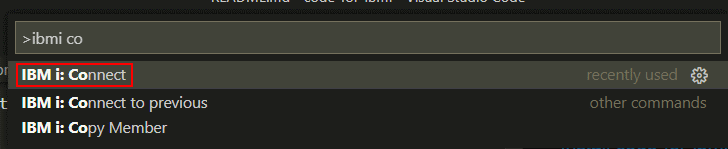

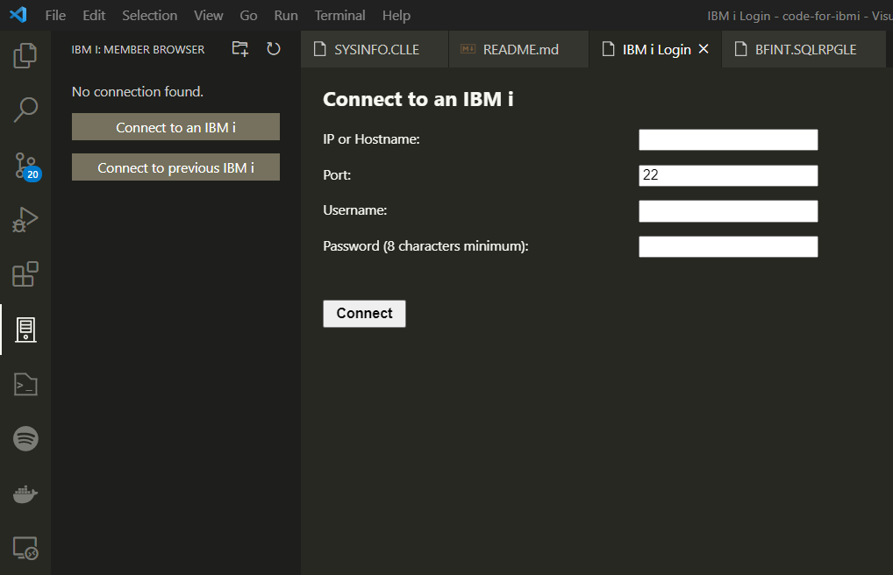

If you have already connected to an IBM i system, you can use ```IBM i: Connect to previous``` to reconnect and save time typing.

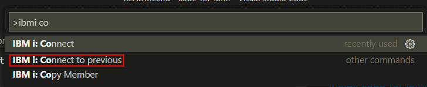

Alternatively, use the sidebar button to reach the same two connect options and the subsequent login form.


After logging in, a status bar item will appear showing the name
of the IBM i system you are connected to.

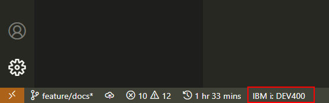

## Settings
To adjust this extension's settings, press <kbd>F1</kbd> and 
search for ```Preferences: Open Settings (UI)```. 
Settings for this extension will be under ```Code for IBM i```

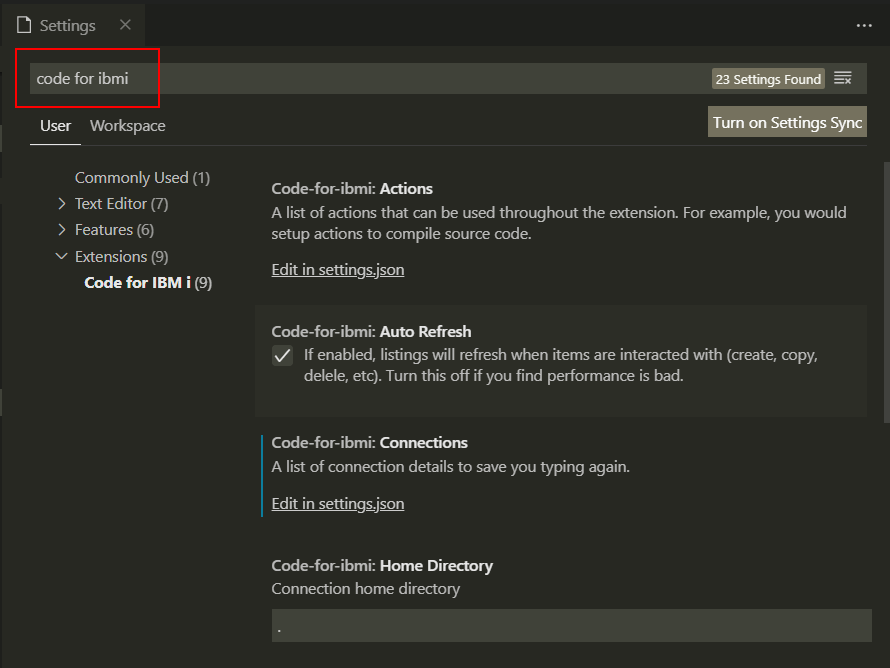

### Actions
Actions that can be performed with the extension. This includes actions to compile source code.

Here is an example of the action used to compile an RPG member:

```json
"code-for-ibmi.actions": [
  {
    "fileSystem": "member",
    "extensions": [
      "rpgle",
      "rpg"
    ],
    "name": "CRTBNDRPG",
    "command": "CRTBNDRPG PGM(&OPENLIB/&OPENMBR) SRCFILE(&OPENLIB/&OPENSPF) OPTION(*EVENTF) DBGVIEW(*SOURCE)"
  }
]
```

This action corresponds to files with ```.rpg``` or ```.rpgle``` extensions. Actions can only work with one `fileSystem`. The two available file systems available are `member` and `streamfile`.

Notice the special identifiers in the command begining with `&`. These identifiers correspond to values of whichever member is currently open in the extension. Members and streamfiles have different variables.

#### Member variables

| Variable | Usage                              |
|----------|------------------------------------|
| &OPENLIB | Library that member resides in     |
| &OPENSPF | Source file that member resides in |
| &OPENMBR | Name of member                     |

#### Streamfile variables

| Variable  | Usage                                           |
|-----------|-------------------------------------------------|
| &BUILDLIB | Values which comes from Code for IBM i settings |
| &FULLPATH | Path to the streamfile.                         |
| &NAME     | Name of the streamfile with no extension        |

New actions can be added by defining a new action object in the settings like the snippet listed above.

### Auto Refresh
When enabled, listings will refresh when items are interacted with (create, copy, delete, etc). If performance is bad, it is suggested to disable this option.

### Connections
List of connection details from prior connections.

Here is a snippet of what the connection details look like:

```json
"code-for-ibmi.connections": [
  {
    "host": "DEV400",
    "port": 22,
    "username": "OTTEB"
  }
],
```

### Home Directory
Home directory for user. This directory is also the root for the IFS browser.

### Library List
Comma delimited list for library list.

### Log Compile Output
When enabled, spool files will be logged from command execution.
These spool files can be found under **OUTPUT** / **IBM i Compile Log**.

### Source ASP
If source files are located in a specific ASP, specify here. 
Otherwise, leave blank.

### Source File List
Source files to be included in the member browser.

### Temporary Library
Temporary library used by extension. This cannot be QTEMP.


## Adding Source Files
In order to make the member browser useful, source files need to be declared
in the ```Code for IBM i``` settings.

In the **Source File List** setting, additional source files can be added
by clicking the **Add Item** button.
The source file follows the intuitive ```LIB/SRCPF``` format.

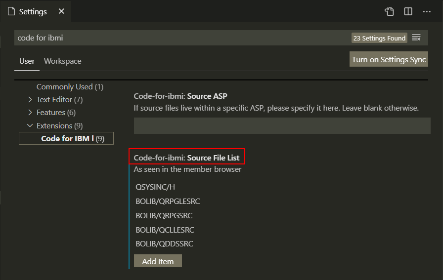

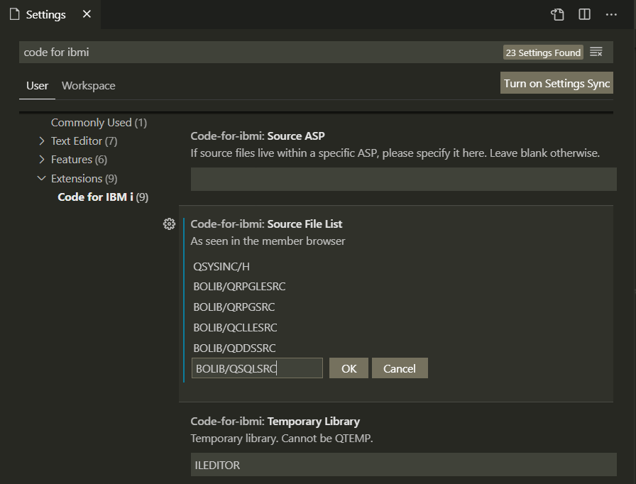

Now in the **Member Browser**, source files will appear.
Each source file can be expanded to reveal its members.

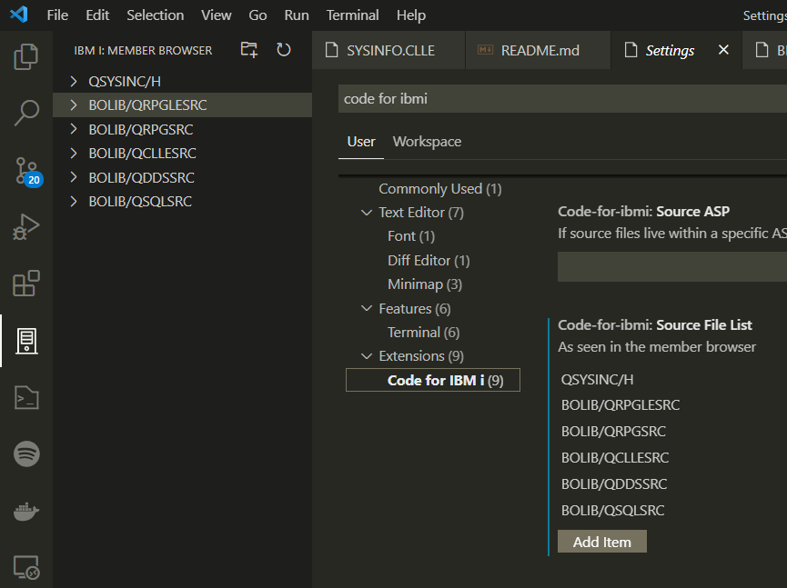

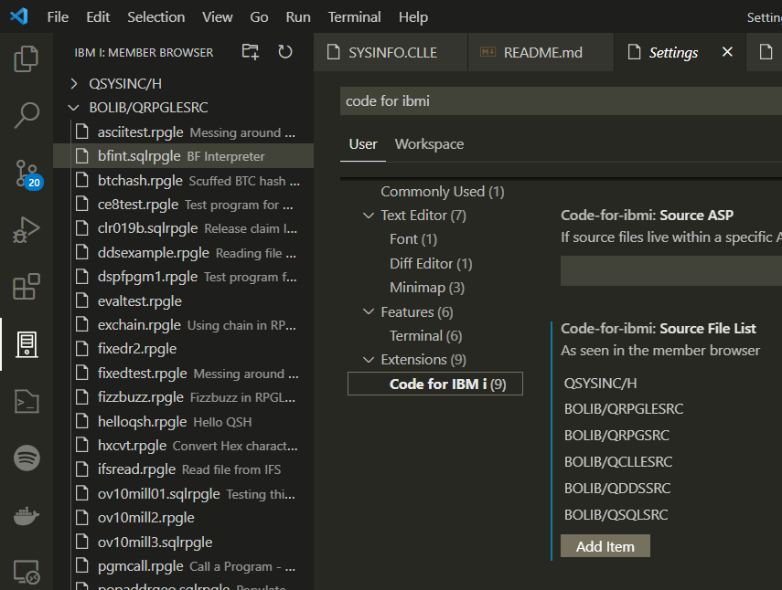

The member list can be manually refreshed by right clicking on the
source file and selecting **Refresh Member List**.

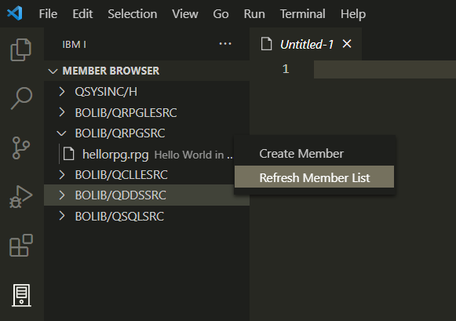


## Opening Source Members
After adding a source file, a source member can now be opened by selecting
it in the member list.

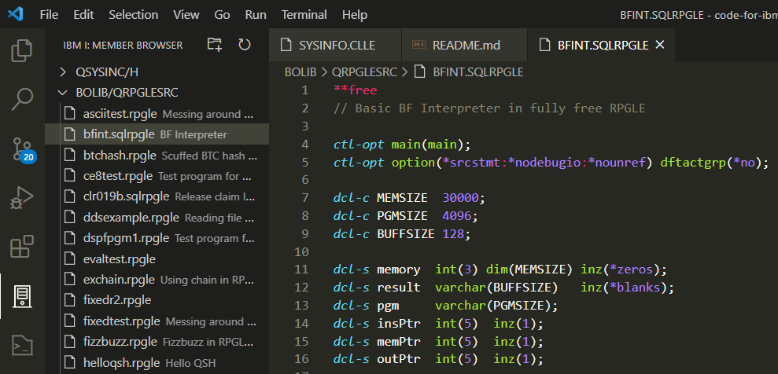


## Compiling Sources
Pressing <kbd>F1</kbd> and search for ```IBM i: Run Action```
will reveal two commands that can compile a source member.

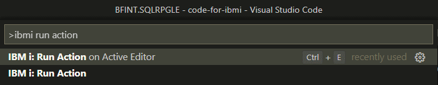

Notice how ```IBM i: Run Action on Active Editor``` can be executed with
<kbd>CTRL</kbd> + <kbd>E</kbd>.

To compile a source member, run the ```IBM i: Run Action on Active Editor``` command.
If there is more than one compile option available for the member type, it will prompt you.

This will result in a message displaying whether the
compilation was successful or not. 

If any compiler warnings or errors occurred, it will be listed under
the **PROBLEMS** tab.

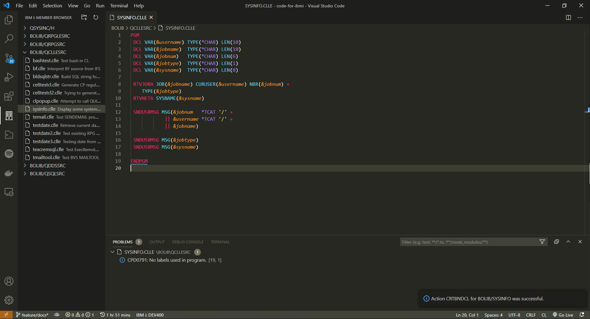

This is what happens when a compiler error occurs.

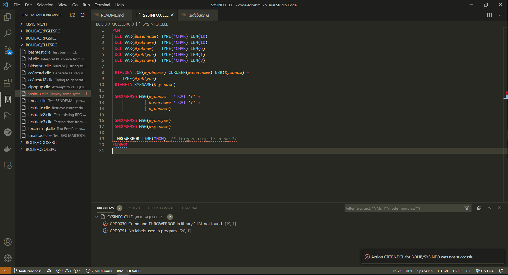

For compile command configuration, see [Settings/Actions](#actions)


## Extension Development
1. clone repo
2. ```npm i```
3. 'Run extension' from VS Code debug.


### Documentation
- install docsify ```npm i docsify-cli -g```
- run local with ```docsify serve docs/```
- by default, runs on http://localhost:3000
