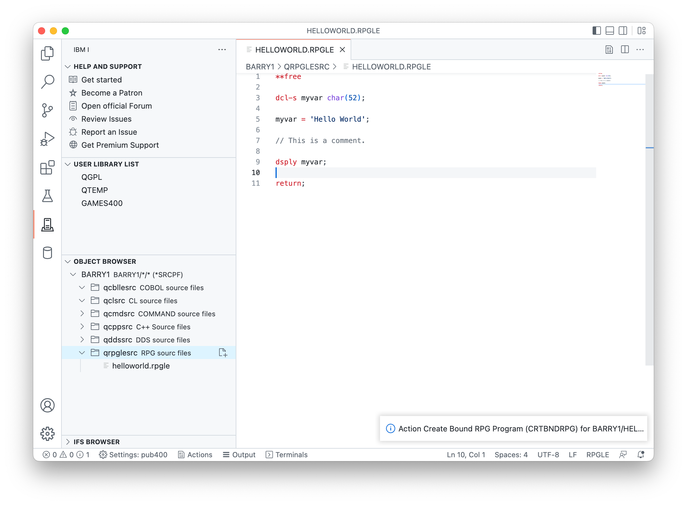
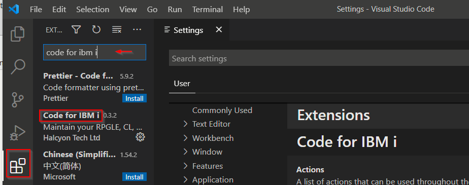

# Code for IBM i

## Développer sur l'IBM i avec VS Code 

Maintenez et Compilez vos RPGLE, CL, COBOL, C/CPP sur l'IBM i depuis Visual Studio Code.



## Prérequis

- Le Démon SSH doit être démarrer sur l'IBM i.
   - (Le programme sous license 5733-SC1 propose un support SSH.)
   - `STRTCPSVR *SSHD` démarre le démon.
   - L'utilisateur `QSSHD` est actif.
- Une connaissance de base des concepts de VS Code. Une introduction se trouve [içi](https://code.visualstudio.com/docs/getstarted/introvideos).

## Installation

Depuis la "Marketplace" de Visual Studio Code: [Code for IBM i](https://marketplace.visualstudio.com/items?itemName=HalcyonTechLtd.code-for-ibmi)

Ou via l'icône des Extensions dans la barre d'activité (à gauche) :


### Extensions recommandées

Il est recommandé d'installer également le [IBM i Development Pack](https://marketplace.visualstudio.com/items?itemName=HalcyonTechLtd.ibm-i-development-pack), Un ensemble d'extensions construites avec ou pour ajouter de la valeur à Code for IBM I. Cela inclut des outils pour la base de données, RPGLE, COBOL , et bien plus.

## Développement d'extension

1. cloner le dépôt  
2. ```npm i```
3. 'Run extension' depuis le débogage de VS Code.

## Guide de démarrage

Pour travailler sur cette documentation:

- cloner le dépôt
- installer "docsify" ```npm i docsify-cli -g```
- lancer en local avec ```docsify serve docs/```
- par défaut, cela se lance sur http://localhost:3000
- Pour aller plus loin [Docsify](https://docsify.js.org/#/)
