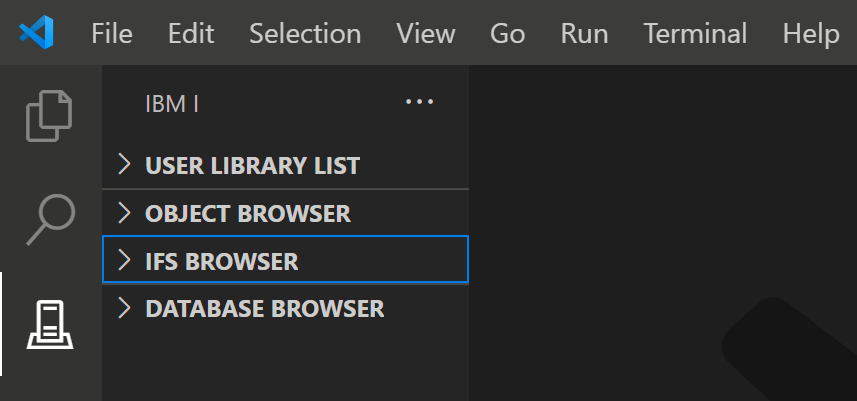
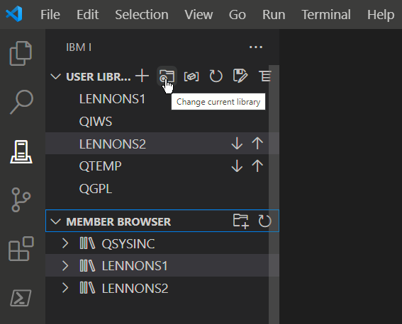

Dans la barre latérale, il y a plusieurs explorateurs pour afficher et interagir avec les différents composants de l'IBM I:

Chacun de ces explorateurs peut être ouvert en cliquant dessus.  
Cliquez ou survolez le titre de l'explorateur pour voir les icônes d'action.  
Passez sur chaque icône pour voir ce qu'il fait.

