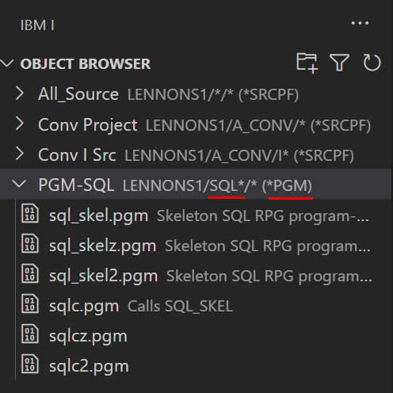
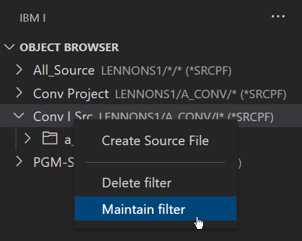

L'explorateur d'objets vous permet d'interagir avec les bibliothèques, les fichiers, les fichiers source, les programmes et autres types d'objets. Sélectionnez un sous-ensemble d'objets avec lesquels vous souhaitez travailler en créant un filtre ou des filtres.

### Créer le premier filtre

Cliquez sur **+ Create new filter** pour créer votre premier filtre (ou cliquez sur l'icône de filtre):

Complétez la boîte de dialogue pour le nouveau filtre.  
Les différentes options sont expliquées via un texte dans la boîte de dialogue:

Cliquez sur **Save Settings** pour créer le nouveau filtre.

L'exemple de filtre ci-dessus répertorie tous les fichiers source dans la bibliothèque LENNONS1:

Notez que le nom du filtre inclut sa définition à droite.

### Créer des filtres supplémentaires

Pour créer un autre filtre, cliquez sur l'icône du filtre pour ouvrir la boîte de dialogue **Filter:New**.

### Exemples de filtre

**Filtre sur un fichier unique**

**Sélection de membres sources**

A single source file files subsetting just some members:

**Sélection de programmes (objets)**

Les programmes SQL* d'une bibliothèque:

### Maintenir des filtres

Changer une définition de filtre est rapide et facile.Faites un clic droit sur le filtre et choisissez  **Maintain filter** pour ouvrir la boite de dialogue du filtre.ou choisissez **Delete filter** pour le supprimer.

