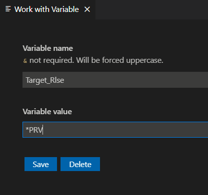

Vous pouvez créer une variable personnalisée à utiliser dans l'instruction de votre action. Pour accéder aux variables personnalisées:

Utilisez <kbd>F1</kbd>, puis recherchez "IBM i Custom variables":

 
 
 ou depuis l'explorateur de la liste des bibliothèques utilisateur:

dans le volet **Work with Variables**, cliquez sur **New Variable** pour ajouter votre variable:

 
 
 Ici, nous ajoutons une variable nommée &TARGET_RLSE.

 

Appuyez sur **save** et la liste des variables personnalisées s'affiche:

Cliquez sur une variable personnalisée pour la modifier ou la supprimer.

#### *Exemple d'utilisation*

Dans toutes les actions CRTBNDxxx ajoutez la variable TGTRLS(&TARGET_RLSE), comme cela:

`?CRTBNDCL PGM(&OPENLIB/&OPENMBR) SRCFILE(&OPENLIB/&OPENSPF) OPTION(*EVENTF) DBGVIEW(*SOURCE)  TGTRLS(&TARGET_RLSE)`

Maintenant un seul changement à la variable TARGET_RLSE affectera toutes les actions CRTBNDxxx.