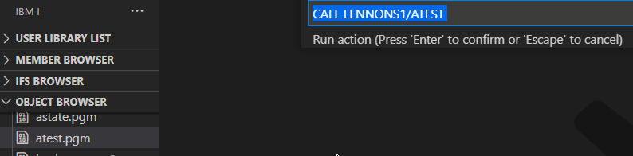
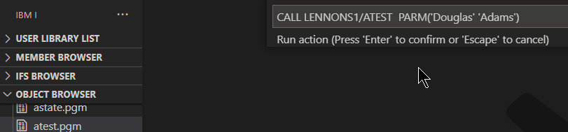
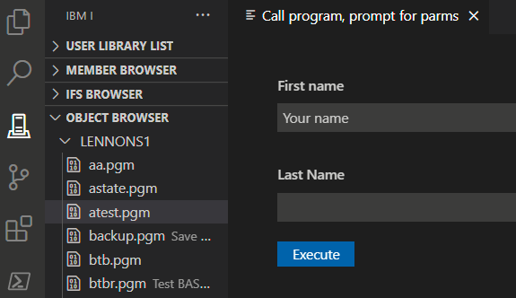
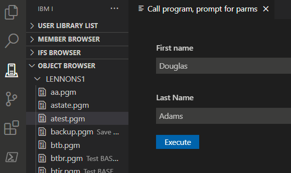
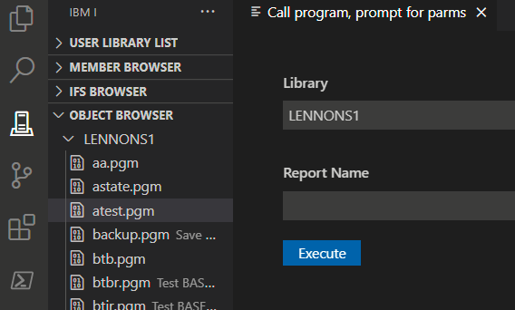
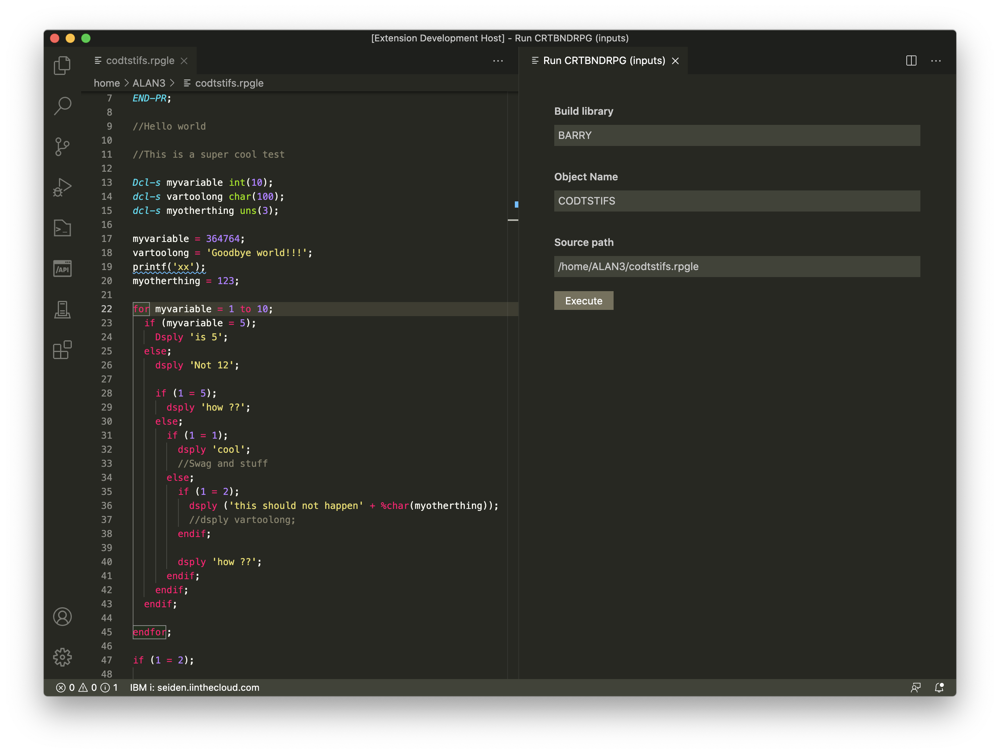

Il existe quatre sortes d'actions:

- Si le type est `file` et `deploy first` est autorisé, cela déploie le fichier sur l'IFS (*deploy workspace location*), puis:
- elle s'exécute immédiatement,
- ou elle s'affiche pour être complétée ou modifiée,
- ou elle affiche une interface utilisateur pour les paramètres.
### Exécution immédiate

Si nous avons une commande "**Call program**" avec une instruction comme cela:

`CALL &LIBRARY/&NAME`  

Elle s'exécute immédiatement à la sélection.

### Affichage pour modification

si l'instruction a un préfixe "**?**", e.g., comme cela:

`?CALL &LIBRARY/&NAME`  

Elle est affichée et vous pouvez la modifier au besoin.

Par exemple, vous pouvez vouloir ajouter **PARM('Douglas' 'Adams')** à la fin.

### Invite

Plutôt que utiliser le "?", Vous pouvez avoir une invite pour les valeurs de l'action.
L'instruction peut intégrée des instructions d'invite pour en invoquer son affichage.

Une instruction d'invite a la forme ``${NAME|LABEL|[DEFAULTVALUE]}`` oû:

- NAME est un nom arbitraire pour le champ invite, mais il doit être unique pour cette action.
- LABEL est le texte pour décrire le champ invite.
- [DEFAULTVALUE] est une valeur **optionnelle** pour initialiser cette du champ invite.

#### *Exemple 1*

Supposons que nous ayons une action "**Call program, prompt for parms**" avec l'instruction suivante:

``CALL &LIBRARY/&NAME PARM('${AAA|First name|Your name}' '${xyz|Last Name}')``

Si nous exécutons l'action, l'écran d'invite sera :

Si nous complétons l'écran comme celui-ci:

en cliquant **Execute** voici la commande qui sera exécutée :

``CALL LENNONS1/ATEST PARM('Douglas' 'Adams')``

#### *Example 2*

Vous pouvez également utiliser des variables dans l'instruction d'invite. Si une action est définie comme celle-ci:

``CALL &LIBRARY/&NAME PARM('${AAA|Library|&CURLIB}' '${xyz|Report Name}')``

La valeur de &CURLIB sera substituée et l'invite affichera:

#### *Example 3*

Voici un exemple plus complexe d'action "**Run CRTBNDRPG (inputs)**".
La'instruction est définie comme cela:

``CRTBNDRPG PGM(${buildlib|Build library|&BUILDLIB}/${objectname|Object Name|&NAME}) SRCSTMF('${sourcePath|Source path|&FULLPATH}') OPTION(*EVENTF) DBGVIEW(*SOURCE) TGTRLS(*CURRENT)``

A l'affichage nous avons: 

