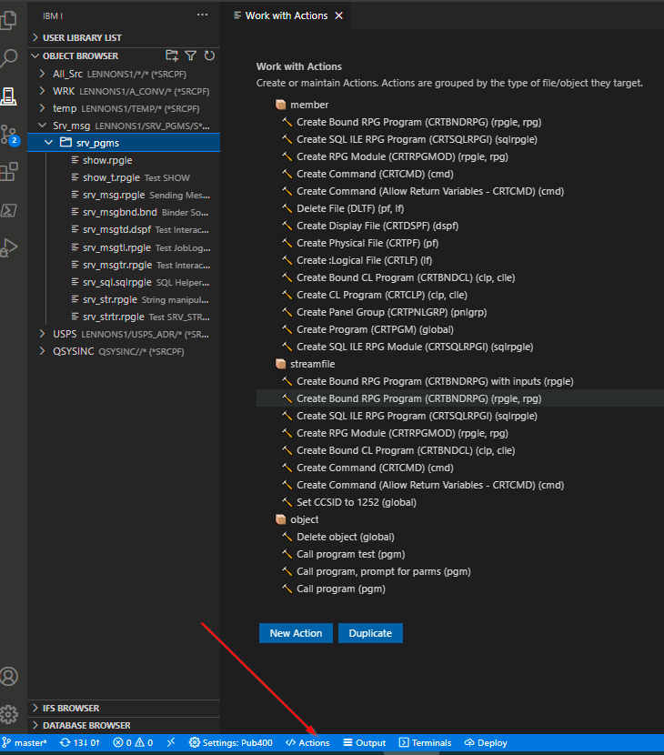
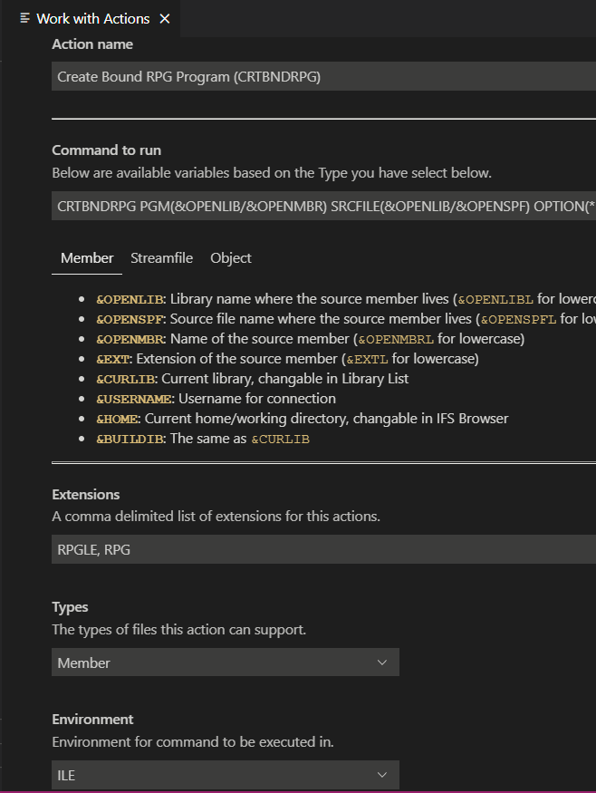

## C'est quoi une action?

Une action est utilisée pour effectuer une tâche sur un membre, un fichier (IFS) ou tout autre type d'objet. Un ensemble complet d'actions définies par défaut est chargé à partir de l'extension. Vous pouvez également changer ou ajouter facilement des actions --voir *View/Change/Add Actions*, ci-dessous.

Les actions sont des commandes prédéfinies utilisées pour effectuer des tâches sur les membres, les fichiers et d'autres types d'objets. Par exemple, pour compiler un fichier source.Les actions peuvent être exécutées à partir de deux endroits différents:

- Pendant que vous écrivez du code.Par exemple, pour compiler un programme ou un module.
- Lorsque vous cliquez avec le bouton droit sur un membre, un fichier ou un objet à partir de l'explorateur d'object *OBJECT BROWSER*.

Un ensemble complet d'actions est fourni, mais vous pouvez ajouter ou modifier une action.

### Exécuter une action
Pour exécuter une action, ouvrez un membre source (ou un fichier IFS) et appuyez sur la touche de raccourci:

- Windows: Control + E
- Mac: Command + E

Cela affiche une liste déroulante avec des actions disponibles pour le fichier ouvert. Utilisez les touches ⬆ ⬇ pour faire défiler les actions et appuyer sur Entrée pour en sélectionner une.

Exemple: Pour exécuter l'action 'CRTBNDRPG', vous devez ouvrir un membre source avec l'extension `RPG` ou `RPGLE`. Ensuite, lorsque vous utilisez le raccourci *Actions* (ci-dessous), vous accédez à la liste des actions disponibles.

### Afficher/modifier/ajouter des actions

 Cliquez sur**Actions** dans la barre d'état, puis affichez, modifiez ou ajoutez de nouvelles actions via l'interface utilisateur:


- Cliquez sur une action pour la changer.
- Ajouter des actions avec *New Action*.
- Copiez une action existante et modifiez-la avec *Duplicate*.

En Ajout ou modification, vous voyez cette même interface utilisateur:



Dans l'exemple ci-dessus, nous modifions 'Create Bound RPG Program (CRTBNDRPG)'. Nous pouvons changer chacune de ces propriétés.

- '**Command to run**' est la commande qui sera exécutée. Remarquer il y a des parties de texte qui commencent par un `&` (ampersand) - Un tel texte est une "variable" qui sera remplacée lorsque l'action sera exécutée. Les commandes peuvent avoir différentes variables en fonction du 'Type' (Membre, fichier, objet) spécifié. Notez qu'en plus des variables fournies, vous pouvez créer vos propres variables.  Voir "Variables personnalisées", ci-dessous.
- '**Extensions**' définit la liste des extensions qui peuvent utiliser cette action. Pour `CRTBNDRPG`, on vise seulement `RPGLE` et `RPG`, alors nous pouvons saisir: `RPGLE, RPG`.
- '**Types**' détermine quel type d'objet peut exécuter cette action. Par exemple, si votre action ne s'applique qu'aux membres sources, alors choisissez 'Member' dans la liste déroulante.
- '**Environment**' détermine où la commande doit être exécutée. Dans ce cas, `CRTBNDRPG` doit s'exécuter dans l'environnement ILE car c'est une commande ILE. Vous avez la possibilité d'exécuter les commandes également via PASE ou QShell.

Une fois terminé, cliquer sur **Save**. Si vous fermez simplement l'onglet, rien ne sera enregistré.

### Stockage des actions

Si vous modifiez ou ajoutez des actions comme ci-dessus, toutes les actions sont enregistrées dans la section ```code-for-ibmi.actions``` de ```settings.json```. Vous pouvez aussi modifier la section ```code-for-ibmi.actions``` manuellement. S'il n'existe pas, vous pouvez créer votre section ```code-for-ibmi.actions``` dans ```settings.json```.  

**Note:** Lorsqu'une section ```code-for-ibmi.actions``` existe dans ```settings.json``` l'ensemble des actions est chargé à partir de celui-ci, et non à partir de l'ensemble des actions par défaut de l'extension.
