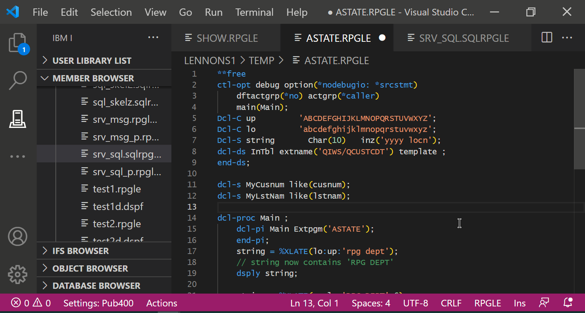
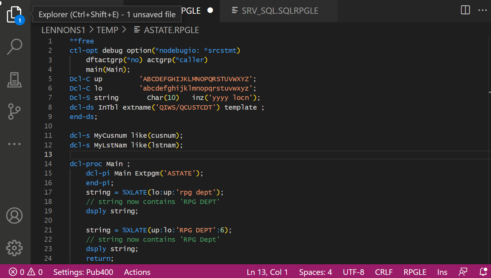
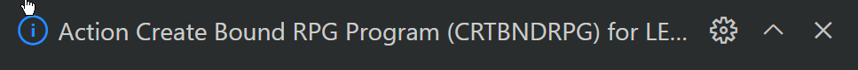
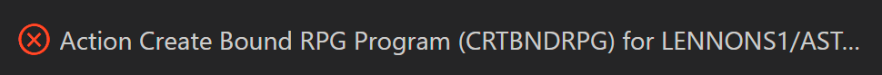
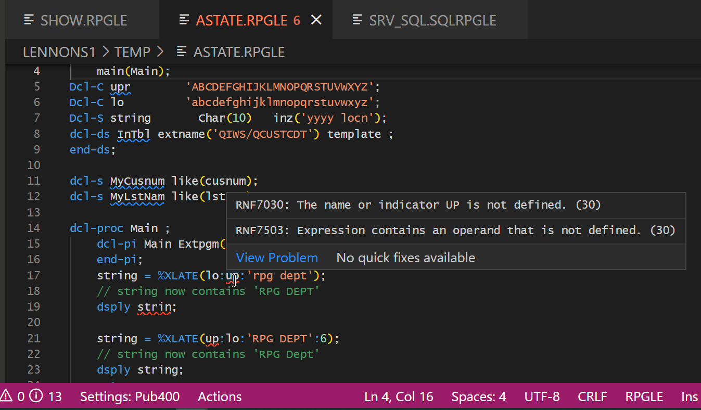
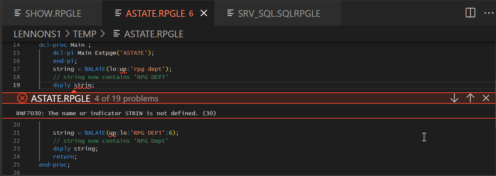
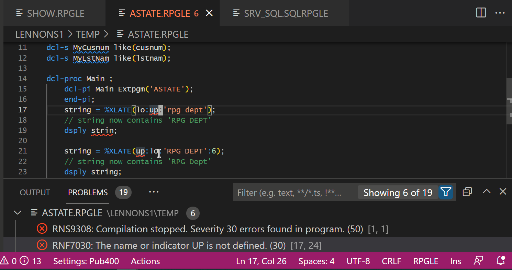
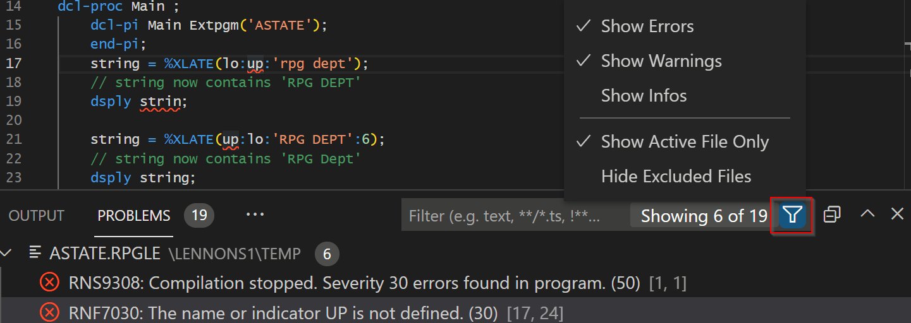
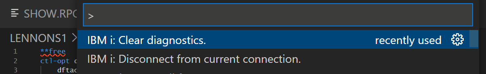
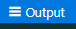

### Edition

Cliquez sur un membre source ou un fichier (IFS) dans l'explorateur pour l'ouvrir.Vous pouvez avoir plusieurs sources ouverts.

 

Maintenant vous pouvez modifier le source à l'aide de toutes les fonctionnalités de VS Code.

Pour agrandir votre volet d'édition, essayez:

- Cacher/Afficher la barre latérale avec **Ctrl+B**. (Ou en utilisant le Menu "View".)
- Basculer en plein écran avec **F11**
  
  

  Cliquez sur **Help** dans le menu pour les conseils, les astuces, l'édition des raccourcis clavier et les tutoriels.

### Dates de source

La prise en charge de la date des sources doit être activée. Elle est désactivée par défaut.Cela peut être modifié dans les paramètres de connexion. 

### Compilation

Compilez le **Volet Actif** avec Ctrl+E.

- S'il y a des modifications non sauvegardées, on vous demande de les enregistrer. On vous propose également de toujours enregistrer avant une compilation.
Si vous cliquez **Save Automatically**, les demandes de compilation suivantes enregistreront toujours les changements avant la compilation. (Dans *Settings: Connection*, Ci-dessous, vous pouvez désactiver l'option.)

- S'il y a plus d'une option de compilation pour votre type de source, sélectionnez celle qui est appropriée.

Si la compilation se termine sans erreur, vous verrez un message d'information comme celui-ci:

### Erreurs de compilation

Si la compilation échoue, vous verrez un message d'erreur comme celui-ci:

Dans la source, les erreurs sont mises en évidence avec des lignes en surbrillance, si vous survolez la ligne en surbrillance, vous verrez les détails de l'erreur:

Vous pouvez passer à la prochaine erreur avec **F8**.  **Shift+F8** pour l'erreur précédente.

Si vous avez l'onglet PROBLEMS ouvert, il affiche la liste des erreurs. Cliquer sur une ligne de l'onglet PROBLEMS tab vous emmènes à la ligne dans la source. (Ctrl+J Ouvre le panneau, Ctrk+Shift+M ouvre l'onglet PROBLEMS.)

Décidez quelles erreurs *Errors*, Avertissements *Warnings* ou messages d'informations *infos* vous voulez afficher en utilisant l'icône de filtre. Si vous avez compilé plusieurs sources, vous pouvez également vérifier **Show Active File Only**;

Vous pouvez supprimer toutes les lignes à l'aide de F1 et rechercher *IBM i Clear Diagnostics*:

### Liste de compilation

Si vous avez *Log Compile Output* choisi dans le paramétrage (voir *Settings: Global*, ci-dessous), Alors, les listes de compilation sont trouvées sous l'onglet *Output* en sélectionnant l'item *IBM i Output*.  Vous pouvez aussi utiliser le raccourci *Output* via l'icône sur la barre d'outils pour afficher la liste de compilation.

