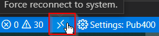

### Se connectez la première fois

Cliquez sur l’icône IBM i.


Cliquez 'Connect to an IBM i'


Complétez ce formulaire.(Vous avez besoin d'un mot de passe ou d'une clé privée)


Ou, appuyez sur <kbd>F1</kbd>, recherchez ```IBM i: New Connection```, et remplissez le formulaire ci-dessus.

### Se connectez ultérieurement

Si vous êtes déjà connecté à un système IBM I, cliquez sur la connexion à l'IBM I dans le navigateur de serveurs "SERVERS".


Après la connexion, un élément dans la barre d'état apparaîtra affichant le nom
du système IBM I auquel vous êtes connecté.


### Se déconnectez

Pour fermer une connexion et se déconnecter, appuyez sur <kbd>F1</kbd>, recherchez ```IBM i: Disconnect from current connection```

### Se reconnectez (connexion instable)

Si votre connexion est instable et parfois se perd, vérifiez le paramètre "Show Reconnect Button". Voir *Settings: Global*, ci-dessous. Cela ajoutera un bouton "Force reconnect to system" à la barre de tâches.

