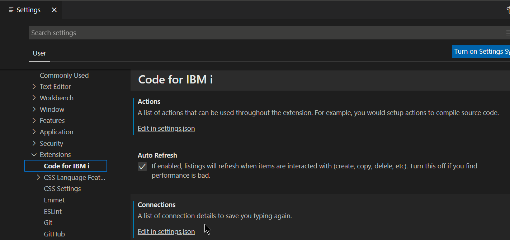
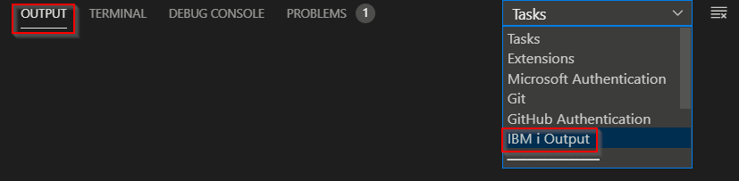
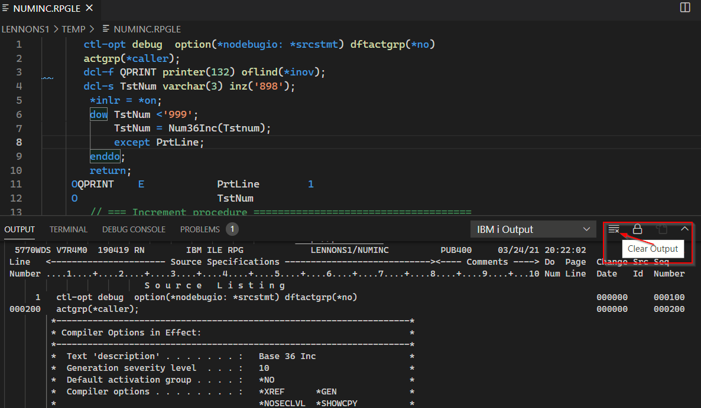

Ces paramètres affectent l'extension (et donc *toutes* les connexions).  
Pour ajuster le paramètre global de l'extension, soit:

- Utilisez la touche standard de VS Code <kbd>Ctrl</kbd> + <kbd>,</kbd> and cliquez `Extensions`
- ou  cliquez  sur `File/Preferences/Settings` puis `Extensions`
-or  press <kbd>F1</kbd>, search for ```Preferences: Open Settings (UI)``` and cliquez `Extensions`.

Les paramètres de l'extension sont sous ```Code for IBM i```



La plupart des paramètres ont une note explicative.
Voici quelques précisions ci-dessous : 

**Il n'est pas recommandé de modifier le JSON manuellement.Si vous le faites, redémarrez / rechargez Vs Code ainsi Code For IBM i prendra en charge les modifications.**

### Actions

Les actions peuvent être modifiées dans **Settings.json** , mais c'est plus facile en cliquant **Actions** dans la barre d'état. Voir *Actions*, plus haut.

### Connections

Les connexions peuvent être modifiées dans **Settings.json**, mais il est préférable d'ajouter comme vu précédemment dans *Se Connecter pour la première fois*.

### Connection Settings

Ce sont les différents paramètres relatifs aux éléments des explorateurs, par exemple, les filtres de fichiers sources dans l'explorateur d'objet. Bien que ceux-ci puissent être modifiés dans Settings.json, la plupart peuvent être plus facilement maintenus en cliquant ou en cliquant avec le bouton droit sur un élément de l'explorateur.

### Log Compile Output

Lorsqu'il est activé, des fichiers 'Spoules' sont enregistrés suite à l'exécution d'une commande ou action.
Ces fichiers de 'spoule' peuvent être trouvés sous le volet **OUTPUT** (View->Output, ou Ctrl + Shift + U). Sélectionner **IBM i Output** dans la liste déroulante à droite.



Vous pouvez remettre à blanc l'onglet de sortie à l'aide de l'icône **Clear Output** sur la droite.


Vous pouvez modifier la taille de la police dans le volet OUTPUT tab dans le fichier settings.json :

````json
"[Log]": {
        "editor.fontSize": 11
    },
````