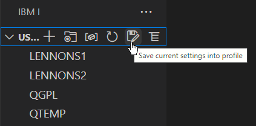

Un profil permet à l'utilisateur de basculer rapidement entre différents paramétrages.  
Vous pouvez utiliser un profil pour modifier rapidement la liste des bibliothèques et d'autres éléments spécifiques à un projet.  
Un profil stocke ces informations:

- Le répertoire personnel sur l'IFS (/home)
- LA bibliothèque courante (CURRENT)
- La liste des bibliothèques
- Les raccourcis IFS
- Les filtres de l'explorateur d'objets
- Les filtres de l'explorateur de Base de données

Si vous n'avez pas de profils, vous pouvez créer votre premier profil à partir des icônes de l'explorateur de la liste des bibliothèques d'utilisateurs:

Une fois votre premier profil créé, l'explorateur des profils est disponible.  
Cette vue permet de basculer rapidement entre les différents profils, mais aussi mettre à jour et supprimer un profil existant.  
Elle affiche aussi le profil en cours.

**La modification du paramétrage** ne mets pas à jour le profil.  
Si vous souhaitez reporter vos modifications sur le profil , vous devez les enregistrer sur ce profil ou sur un nouveau.