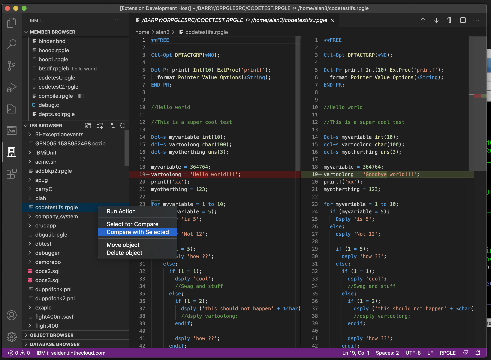
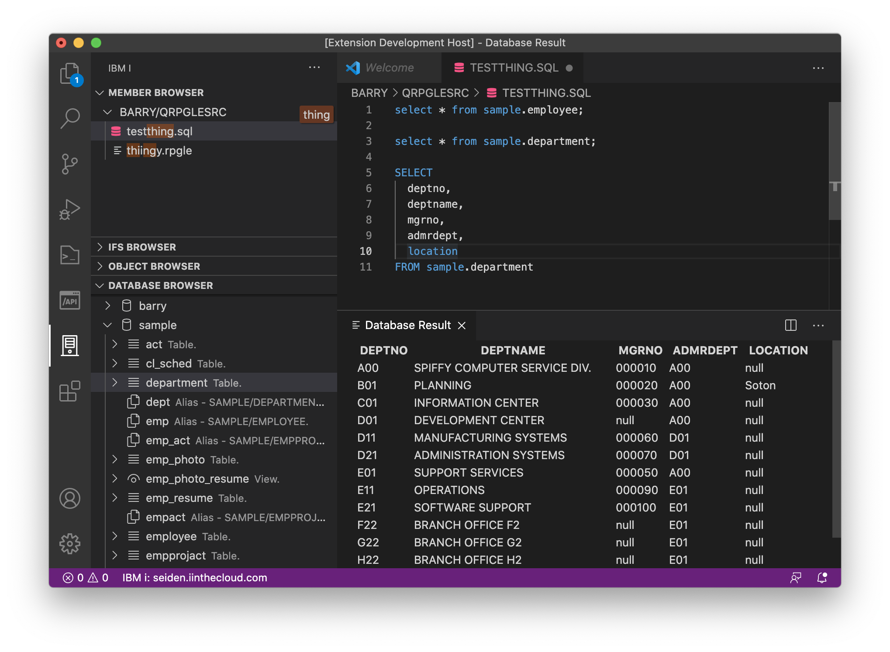

### Comparaison de source

Comparez deux sources, qu'ils soient membres ou fichiers.

1. Faites un clic droit sur l'un ou l'autre type, choisissez `Select for compare`
2. Cliquez avec le bouton droit sur l'autre source que vous souhaitez comparer et choisir `Compare with Selected`



### Exécution d'une instruction SQL

Installez l'extension [Db2 for IBM i extension](https://marketplace.visualstudio.com/items?itemName=HalcyonTechLtd.vscode-db2i) pour cette fonctionnalité.  

Il est également possible d'exécuter des instructions SQL directement à partir de l'éditeur dans un fichier SQL. Vous pouvez soit mettre en évidence l'instruction que vous souhaitez exécuter ou déplacer votre curseur sur l'instruction et utiliser `Ctrl+R/Cmd+R` pour exécuter l'instruction.  
**note: Les instructions ne s'exécutent qu'en mode SQL (pas SYS) et n'héritent pas de la liste des bibliothèques**

L'ensemble des résultats SQL apparaît dans le volet `IBM i: Results`.



Un peu comme le pré-processeur SQL, vous pouvez exécuter des commandes CL à partir d'un script SQL. En plus des commandes CL, vous pouvez également obtenir votre résultat SQL sous la forme d'un **json** ou d'un **csv**.

```
-- result set as normal table
select * from sample.employee;

-- result set as JSON, will open in a new file
json: select * from sample.employee;

-- result set as CSV, will open in a new file
csv: select * from sample.employee;

-- run CL commands. output is directed to IBM i output channel
cl: dspffd sample/employee
```


### Recherche dans des fichiers sources et des répertoires IFS

Cliquez avec le bouton droit puis cliquez sur `Search` sur le répertoire IFS ou le fichier source pour rechercher dans le contenu des fichiers IFS ou dans celui des membres sources.

### Mode Insertion

VS Code fonctionne en mode insertion. Cela peut être ennuyeux lors de la modification d'une source en format fixe, par exemple DDS.Heureusement, il y a une extension [Overtype](https://marketplace.visualstudio.com/items?itemName=DrMerfy.overtype) qui vous permet de basculer entre le mode *insertion* et le mode *Écrasement*. Elle peut également afficher le mode en cours dans la barre d'état.

### Taille de police

La taille de la police dans l'éditeur est contrôlée par le paramétrage `Editor: Font Size` (dans settings) de VS Code. Cependant, vous pouvez également modifier temporairement la taille de la police de l'éditeur , en plaçant votre curseur dans un éditeur puis en maintenant Ctrl et en utilisant votre barre de défilement de souris.

La taille de la police dans les menus, et les barres d'activité et d'état peut être modifiée en maintenant la touche Ctrl enfoncée , puis les touches + ou -. De tels modifications restent de session à la session.Cependant, cela modifiera également la taille de la police de l'éditeur et vous devrez peut-être l'ajuster comme ci-dessus pour la session en cours.

> Règle de base: **expérimenter**.