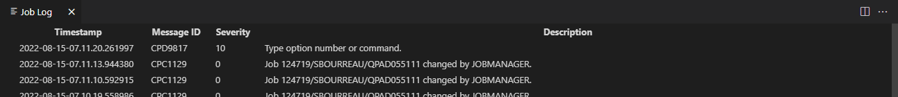

The Job Browser allows you to list IBMi jobs. Select the jobs you want to view by creating one or more filters.
In addition, it's possible to make some actions on the job.

#### Create First Filter

Click on the **+ Create new job filter** prompt to create your first filter (or click on the filter icon):

Complete the new filter dialog. The explanatory text in the Create Filter dialog explains the options:

**Click SAVE to create the new filter.**

The filter example above list all my jobs:

Note that the filter name has the filter definition the right.

#### Create Additional Filters

To create another filter,  click the filter icon to open up the new filter dialog.

#### Actions

**Change Job**

The Change Job (CHGJOB) command changes some of the attributes of a job. With the exception of a change in job queue, the job can be in a job queue or in an output queue, or it can be active in a subsystem. The job queue can only be changed when the job is a batch job and is in a job queue. If the job is in the output queue, only the <b>Output priority (on OUTQ) (OUTPTY)</b>, the <b>Job log output (LOGOUTPUT)</b>, and the <b>Spooled file action (SPLFACN)</b> can be changed. With the exception of the class attributes, the new attributes remain in effect for the duration of the job unless they are changed by another CHGJOB command. The class attributes remain in effect until the routing step that is currently active ends. If no routing step is active when the changes are made, they apply to the next routing step that is started. If an attribute that no longer affects the job is changed, a message is sent to the user of the command. For example, if the job has already completed running, it is too late to change the <b>Output queue (OUTQ)</b> and <b>Job priority (on JOBQ) (JOBPTY)</b> parameters. If any output files are still on the output queue, however, changing the OUTPTY parameter changes their output priority.  

**End Job**

The End Job (ENDJOB) command ends the specified job and any associated inline data files. The job can be on a job queue, it can be active, or it can have already completed running. 
You can specify that the application program is given time to control end-of-job processing. If no time is given or if cleanup cannot be performed within the given time, the system performs minimal end-of-job processing, which can include: 

<ul>
<li>Closing the database files.</li>
<li>Spooling the job log to an output queue.</li>
<li>Cleaning up internal objects in the operating system.</li>
<li>Showing the end-of-job display (for interactive jobs).</li>
<li>Completing commitment control processing</li>
<li>Before ending the job, you should verify that no logical unit of work is in an in doubt state due to a two-phase commit operation that is in progress. If it is, then the value of the Action if ENDJOB commitment option can greatly impact the ENDJOB processing. For example, if the Action if ENDJOB commitment option is the default value of WAIT, this job will be held up and will not complete its end of job processing until the commitment control operation is completed. This ensures database integrity on all related systems. For specific instructions on how to determine these conditions, and for a description of all the impacts of ending this job under these conditions, see the Backup and Recovery book.</li>
</ul>
             
<b>Restrictions:</b> The issuer of the command must be running under a user profile which is the same as the job user identity of the job being ended, or the issuer of the command must be running under a user profile which has job control (*JOBCTL) special authority. This restriction is enforced even when ending the current job. 
 
The job user identity is the name of the user profile by which a job is known to other jobs. It is described in more detail in the Work Management book.  

**History Job**

Shows commands and related messages for the job:

**Hold Job**

The Hold Job (HLDJOB) command makes a job ineligible for processing by the system. The job is held until it is: 

<ul>
<li>Released by the Release Job (RLSJOB) command</li>
<li>Cleared by the Clear Job Queue (CLRJOBQ) command</li>
<li>Ended by the End Job (ENDJOB) command</li>
<li>Ended (while the job is active) by the End Subsystem (ENDSBS) command, the End System (ENDSYS) command, or the Power Down System (PWRDWNSYS) command</li>
</ul>
Holding a job causes all threads within the job to be held.  

<b>Note:</b> If you use this command to hold a job that has exclusive access to any resources on the system, these resources are not available to other jobs. Other jobs which require access to those resources will either fail or wait indefinitely.  

<b>Restrictions:</b> The issuer of the command must be running under a user profile which is the same as the job user identity of the job being held, or the issuer of the command must be running under a user profile which has job control (*JOBCTL) special authority.  

**Release Job**

The Release Job (RLSJOB) command makes a job eligible for processing either after that job is held from processing by the Hold Job (HLDJOB) command, or if the job was submitted to the system as a held job by the Batch Job (BCHJOB) command or Submit Job (SBMJOB) command. The job being released can be on the job queue, on an output queue, or active in a subsystem (competing for system resources) when it is held. Releasing a job causes all threads within the job to be released. Spooled output files being held because *YES is specified for the <b>Hold spooled files</b> (SPLFILE) parameter in the Hold Job (HLDJOB) command are also released. Only those spooled output files which are on output queues in the library name space of the thread issuing this command (RLSJOB) will be released. If the <b>Spooled file action (SPLFACN)</b> job attribute is *DETACH and the job is ended while the spooled files are held, the spooled files cannot be released using the RLSJOB command. To release spooled files after the job has been removed from the system, use the Release Spooled File (RLSSPLF) command.  
<b>Restrictions:</b> The issuer of the command must be running under a user profile which is the same as the job user identity of the job being released, or the issuer of the command must be running under a user profile which has job control (*JOBCTL) special authority.  

#### Maintaining Filters

Changing a filter definition is quick and easy. Just right click on the filter and chose **Maintain job filter** to open up the filter dialog. Or chose **Delete job filter** to remove the filter definition.

