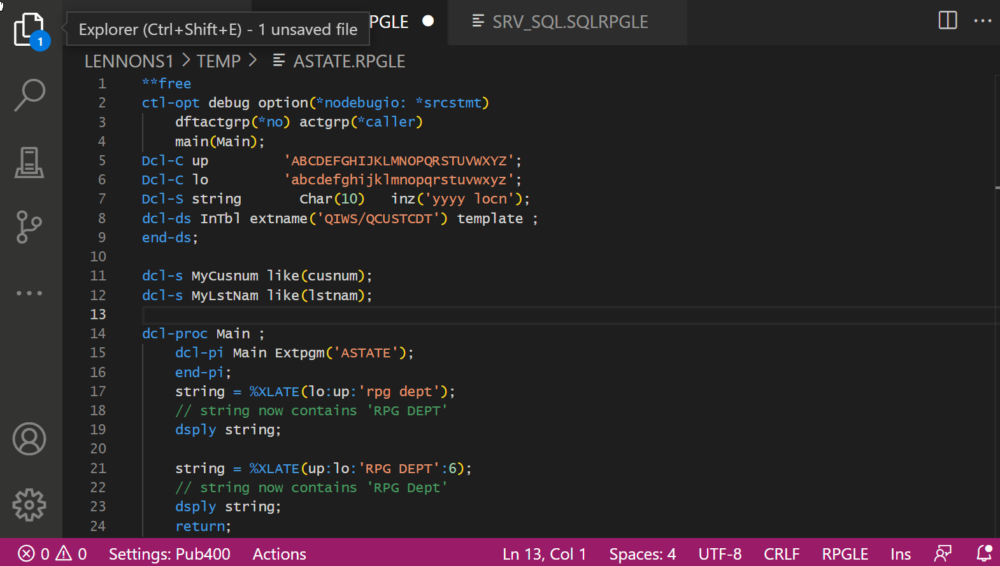
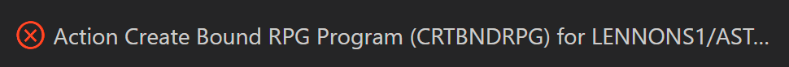
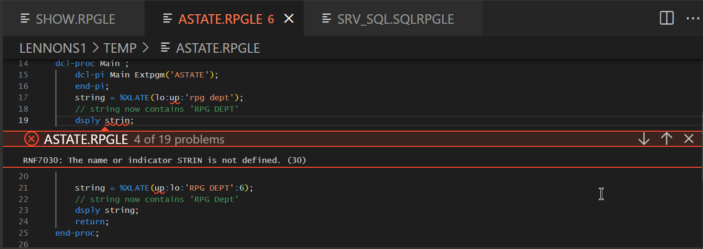
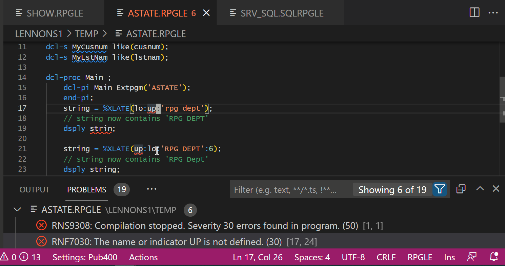
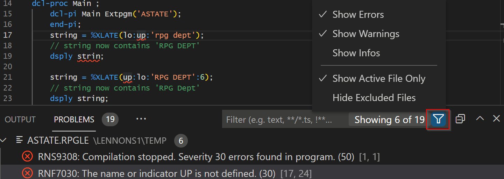
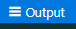

## Editing and Compiling

### Editing

Click on a source member or stream file in the browser to open it. You can have multiple sources open.

 

Now you can edit the source using all the features of VS Code.

To maximize your editing tab try:

- Hide/show the side bar with **Ctrl+B**. (Or using the View menu.)
- Toggle Full screen with **F11**
  
  

  Click **Help** in the menu for  tips, tricks, editing keyboard shortcuts and tutorials.

### Source dates

Source date support must be enabled and are disabled by default. This can be changed in the Connection Settings. 

### Compiling

Compile the **active tab** with Ctrl+E.

- If there are unsaved changes, you will be told it first must be saved, and also given the option to always save before a compile.
If you click **Save Automatically**, sequent compile requests will always save first if there are changes. (In *Settings: Connection*, below, you can turn off the auto save option.)

- If there is more than one compile option for your source type, select the appropriate one.

If the compile completes without error you will see an informational message like this:

### Compile Errors

If the compile fails, you will see an error message like this:

In the source, the errors will be highlighted with squiggly lines, and if you hover over the squiggly line you see details of the error:

You can jump to the next error with **F8**.  **Shift+F8** for the previous error.

If you have the PROBLEMS tab open in the Panel, it shows the list of errors. Clicking on a line in the PROBLEMS tab will take you to the line in the source. (Ctrl+J opens the panel, Ctrk+Shift+M opens the PROBLEMS tab.)

Decide which Errors, Warnings or Info messages to show using the Filter icon. If you have been compiling several sources then you may also want to check **Show Active File Only**;

You can remove all the squiggly line using F1 and searching for IBM i Clear Diagnostics:

### Compile Listing

If you have *Log Compile Output* checked in settings (see *Settings: Global*, below), then compile listings are found under the Output tab by selecting IBM i Output.  Use the shortcut Output icon on the tool bar to jump to the compile listing.

