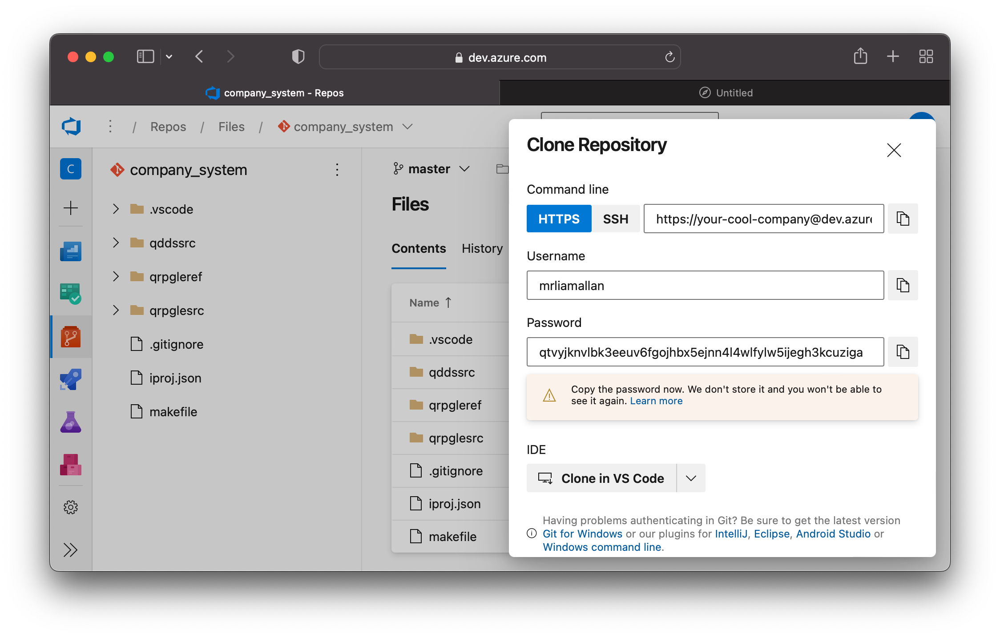
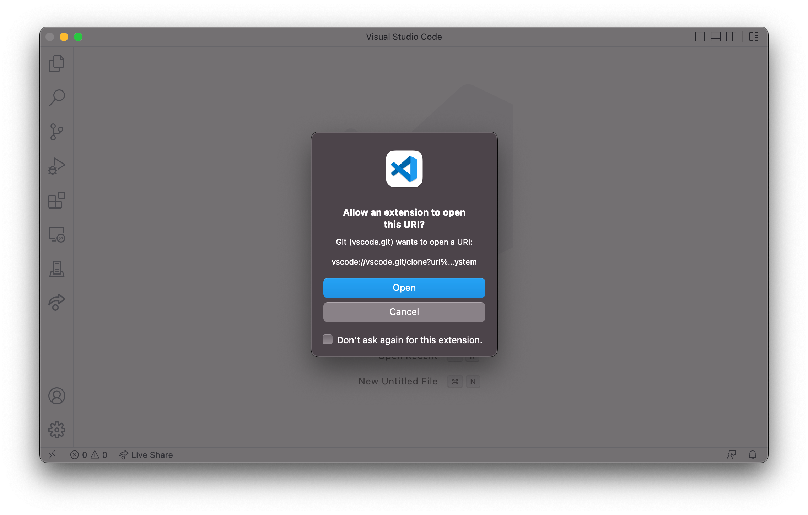
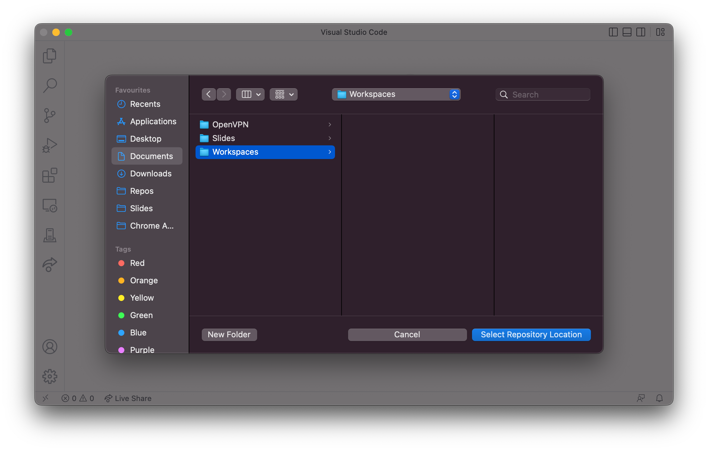
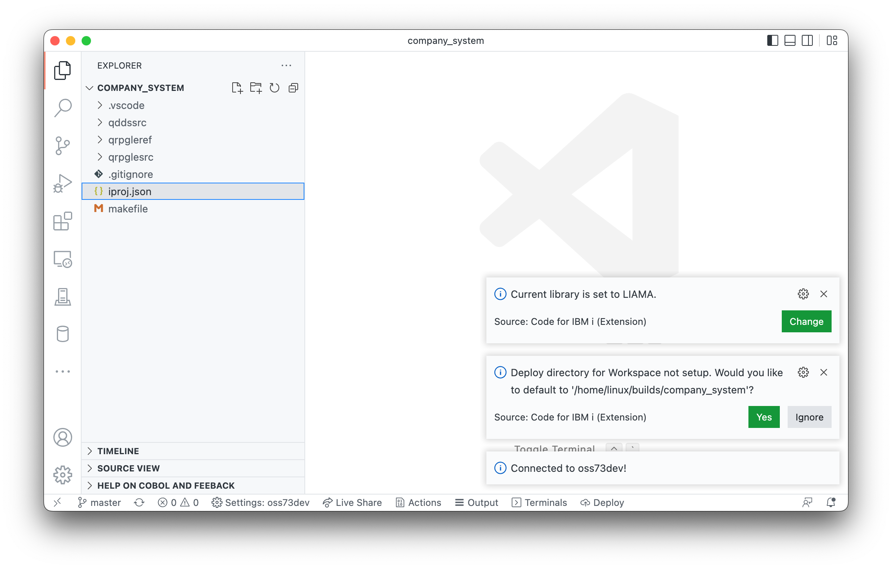

When using Visual Studio Code and git, it is possible to open the project up automatically from Azure DevOps.

Find the repository you want to work with on Azure DevOps and press the Clone button. Make sure HTTPS is selected and before continuing, make sure the git credentials are visable - those will be used later.

When ready, copy the password to your clipboard and select 'Clone in VS Code'. This will launch VS Code and make sure the user wants to run this action:

VS Code will ask you where you want to clone the repository to.

When the clone is done, it will ask you if you want to Open the repository folder. Selecting 'Open' will add it to the Workspace.

Now the source code is on your local machine, you can go ahead and connect to your development system. Since this is a brand new folder, you will be asked if you'd like to set the default deploy directory. It is recommended to use the default.

From here, you can start developing and compiling. If this is your first time, be sure to read the [Local Development](getting-started.md) documentation to understand what the deploy directory is used for and how to run compile commands.