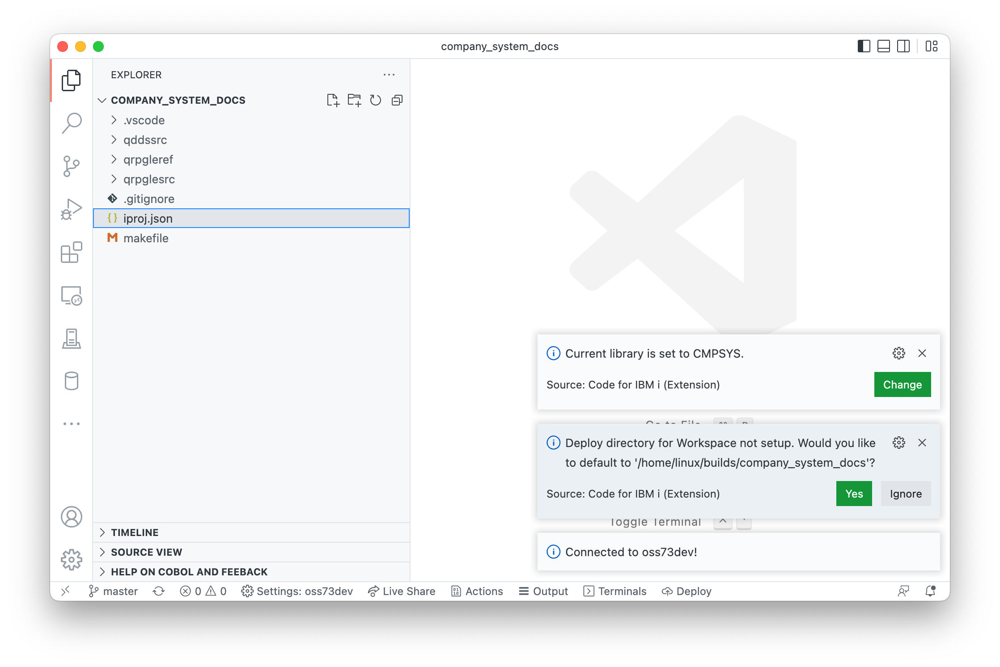
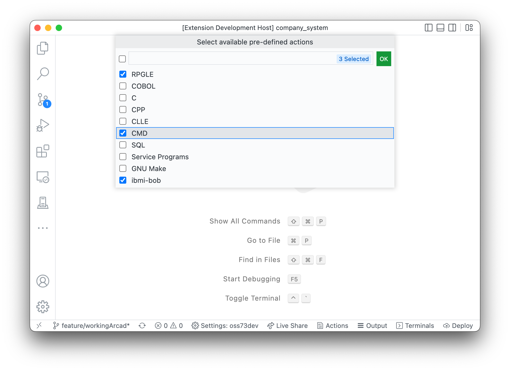

It is possible for the user to develop in a local workspace folder and deploy+compile on IBM i.

If the user opens a Workspace before connecting to an IBM i:

1. A new information messgae will show the user what their current library is,
2. If this is the first time connecting with this workspace, it will 
   * prompt the user to set a default Deploy directory, 
   * if no `actions.json` file is found will ask the user if they'd like to create a default
3. a new right-click option will appear on IFS directories to deploy to that directory
4. a 'Deploy' button will appear on the status bar

## Guides

* This step-by-step guide [in the rpg-git-book](https://worksofliam.github.io/rpg-git-book/7-tooling-vscode.html).
* A [video tutorial on YouTube](https://www.youtube.com/watch?v=XuiGyWptgDA&t=425s), showing the setup from scratch.
* Easily cloning from [Azure DevOps](azure.md).

## 1. Opening a Workspace Folder

Opening a folder in Visual Studio Code adds that folder to that Workspace. You need at least one folder open in the Visual Studio Code workspace for local development.

## 2. Setting the deploy location

If it is the first time connecting with the workspace it will prompt the user to set a default Deploy directory.



If you would prefer to change the default location, the user can right-click on any directory in the IFS Browser and select the 'Deploy Workspace to location' option.

The user can change the deploy directory at any by using the same right-click option on another directory.

## 3. The Deploy button / Running the deployment process

Using the 'Deploy' button on the status bar will start the deployment process. If the workspace has more than one folder, the user will have to select which folder they want to deploy.

There are three options for deployment:

1. Working Changes: This only works if the chosen workspace folder is a git repository. Code for IBM i will look at the git status to determine the files that have been changed since the last commit (unstaged and staged) and only uploads those files.
2. Staged Changes: The same as the "Working Changes" option, but only uploads staged / indexed files.
3. All: Will upload all files in the chosen workspace folder. Will ignore files that are part of the '.gitignore' file if it exists.

The user can also defined Actions that are for the 'file' (local) type to run the deploy before running the Action.

## 4. Workspace Actions (deploy & build)

Similar to other repository settings, users can now store Actions as part of the Workspace. Users can now create `.vscode/actions.json` inside of your Workspace, and can contain Actions that are specific to that Workspace. That configuration file should also be checked into git for that application. Alternatively, if you're using [the new `iproj.json` standard](https://ibm.github.io/ibmi-bob/#/prepare-the-project/project-metadata), the `buildCommand` and `compileCommand` will also appear as Actions automatically.

There is a tool that can generate an initial `actions.json` file for you. After connecting to a system, open the command palette (F1) and search for 'Launch Actions Setup'. This shows a multi-select window where the user can pick which technologies they're using. Based on the selection, an `actions.json` will be created.



Here is an example `actions.json` setup, which requires deployment to happen before triggering BoB. VS Code will prompt content assist when working with `actions.json`. You could replace BoB with any build system here (e.g. make, or perhaps a vendor-specific tool.).

```json
[
  {
    "name": "Deploy & build with ibmi-bob 🔨",
    "command": "error=*EVENTF lib1=&CURLIB makei -f &BASENAME",
    "extensions": [
      "GLOBAL"
    ],
    "environment": "pase",
    "deployFirst": true
  },
  {
    "name": "Deploy & build with GNU Make 🔨",
    "command": "/QOpenSys/pkgs/bin/gmake &BASENAME BIN_LIB=&CURLIB",
    "extensions": [
      "GLOBAL"
    ],
    "environment": "pase",
    "deployFirst": true
  }
]
```

Now, when the user runs an Action against the local file (with `Control/Command + E`), they will appear in the list. 

