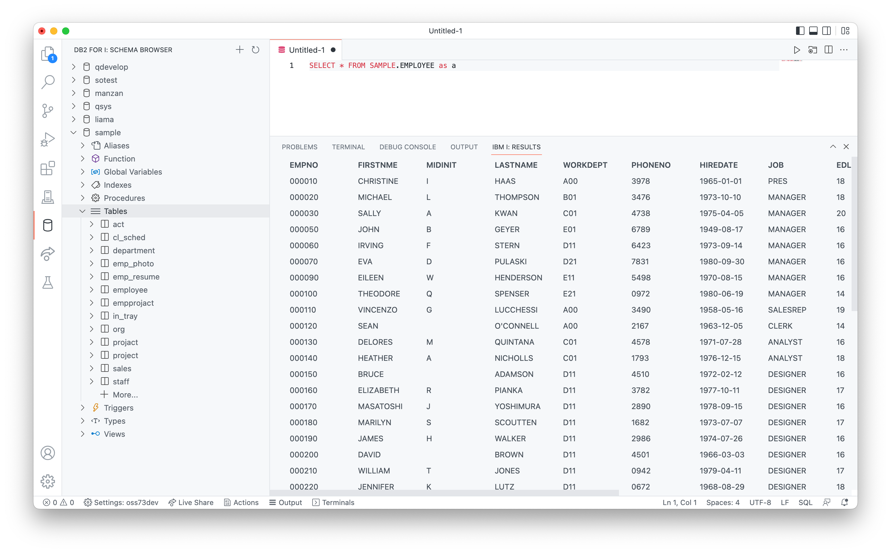

The Db2 for i is a seperate extension that allows users to browse database schemas on any connected system.

## Install

The extension can be [installed from the Marketplace](https://marketplace.visualstudio.com/items?itemName=HalcyonTechLtd.vscode-db2i) and is also part of the [IBM i Development Pack](https://marketplace.visualstudio.com/items?itemName=HalcyonTechLtd.ibm-i-development-pack).

## Usage

The Db2 for i extension adds a new view called Schema Browser, which allows the user to add existing schemas to the list and will allow them to browse existing objects. The user can also execute SQL queries and view results inside of Visual Studio Code. When editing SQL sources, the user will also have access to content assist.

### Respecting current library / schema

The Db2 for i extension respects the current library / scheme as setup in the User Library List view. You can also right click on schemas in the Schema Browser and change the current schema that way.

### Content assist

When writing SQL sources, you will have access to content assist on:

* objects inside of a schema (tables, views, aliases, functions, procedures)
* columns inside of a table that is declared with the `as` clause

If you do not qualify an object name, it will default to use the current schema.

### Executing statements

Either:

* open an existing `.sql` file (source member, streamfile or local file)
* create a new file
    1. create a file (control / command + N)
    2. change the language ID to `sql`

After you have an SQL source open, you can either:

* Move your cursor onto the statement you want to execute and:
    * use the play button in the top right to execute
    * use the shortcut (control / command + R) to execute the statement

The result set will appear below the statement. As your scroll through the result set, more data will load. This is to speed up the performance of the query.

SQL statements get executed with SQL naming in the extension.

### Viewing table contents

If you are using the Schema Browser to browse objects, you are able to use the 'view' icon when hovering over a table item which will automatically open and execute a basic select statement.