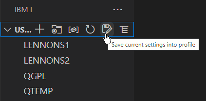

A profile allows the user to switch between settings quickly. You could use a profile to quickly change library list and other items specific to a project. A profile stores this information:

- The home / working directory
- The current library
- The library list
- The IFS shortcuts
- The object browser list
- The database browser list

If you have no existing profiles, you can create your first one from the User Library List view:

After your first profile has been created, the Profiles view will become availabe. The Profiles view allows you to quickly switch between profiles, as well as update and delete existing profiles. The Profiles view will also show you what the last profile you set is.

**Changing any of the settings** will not update the profile. If you change the library list and want this to reflect on the profile, you can save over the profile or into a new one.